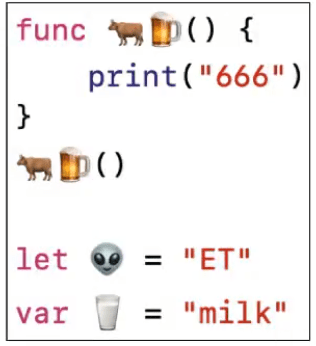

## 编译流程

## swiftc

- swiftc存放在Xcode内部
  - Contents/Developer/Toolchains/XcodeDefault.xctoolchain/usr/bin
- 一些操作
  - 生成语法树: swiftc -dump-ast main.swift
  - 生成最简洁的SIL代码: swiftc -emit-sil main.swift
  - 生成LLVM IR代码: swiftc -emit-ir main.swift -o main.ll
  - 生成汇编代码: swiftc -emit-assembly main.swift -o main.s
- 对汇编代码进行分析，可以真正掌握编程语言的本质

## Hello World

## Playground 

### View

### ViewController

### 多Page

### 注释

## 基本语法

### 常量

### 标识符

- 标识符(比如常量名、变量名、函数名)几乎可以使用任何字符
- 标识符不能以数字开头,不能包含空白字符、制表符、箭头等特殊字符

### 常见的数据类型

### 字面量

### 类型转换

### 元组（tuple）

