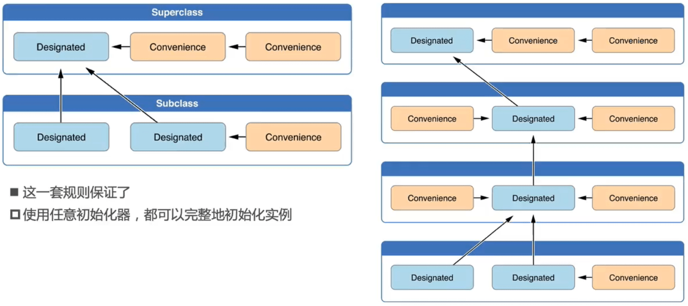
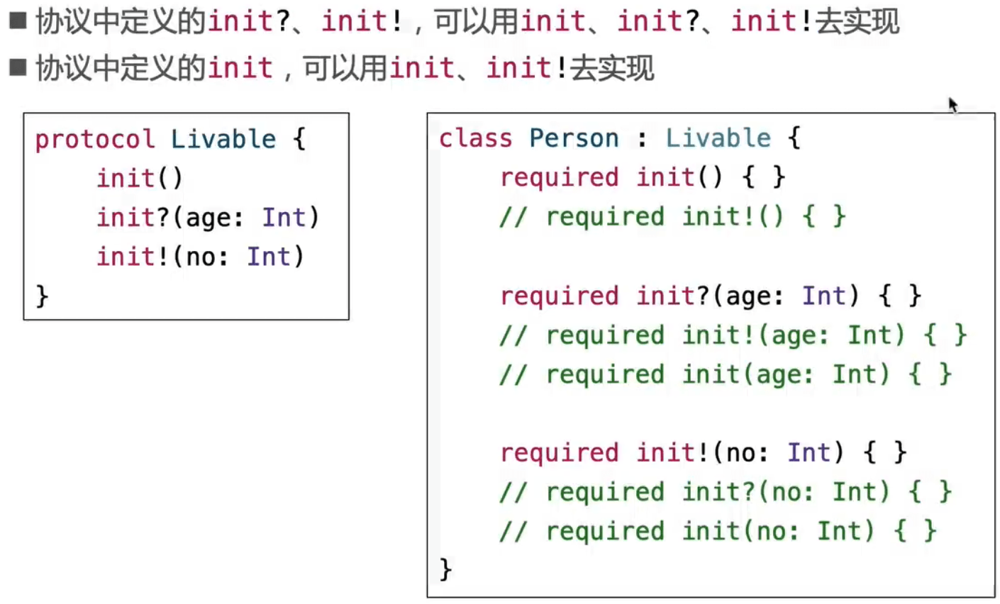

## 初始化

### 初始化器

#### 初始化器的相互调用

### 安全初始化

#### 两段式初始化

#### 安全检查

### 重写

### 自动继承

### required

### 属性观测器

### 可失败初始化器

### 反初始化器( deinit )

## 可选链( Optional Chaining )

## 协议

### 协议( Protocol )

### 协议中的属性

### static、class

### mutating

### init

- 因为protocol中声明了init，类和其子类都遵循这个协议，所以要加上required，因为Student继承自Person，所以需要加上override，这个关键字表达的含义不同
- 如果Student不遵循Livable这个协议，且Person中的init加上required，则Student中init只需要加上required，不需要加override，其肯定是继承自父类。 

#### init、init?、 init!

- 注意和类的区别，类不允许用init？/init! 重写init，协议可用init！重写init

### 协议的继承

### 协议组合

### CaseIterable

### CustomStringConvertible

### Any, AnyObject

### is、as?、 as!、as

### X.self，X.Type， AnyClass

#### 元类型的应用

- required是必须的

### Self

### 补充

- 以上效果相同（转汇编代码一样）
- 大部分情况Person和Person.self等价，但作为参数时只能用Person.self

- AnyClass等价于AnyObject.self，type(of: AnyObjectt)

