## 错误处理

### 错误类型

- 开发过程常见的错误
  - 语法错误(编译报错)
  - 逻辑错误
  - 运行时错误(可能会导致闪退,一般也叫做异常)
  - ...... 

#### 自定义错误

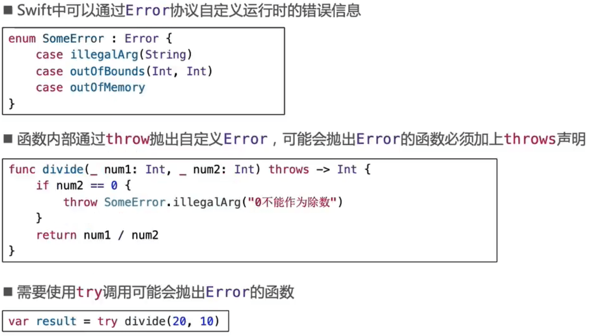

### do-catch

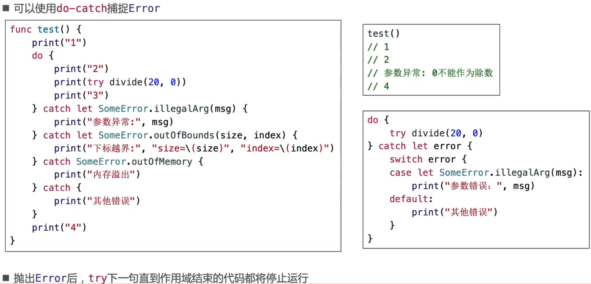

- 右下角的catch let error可以将后面的let error省略，catch内部有变量error

#### 处理Error

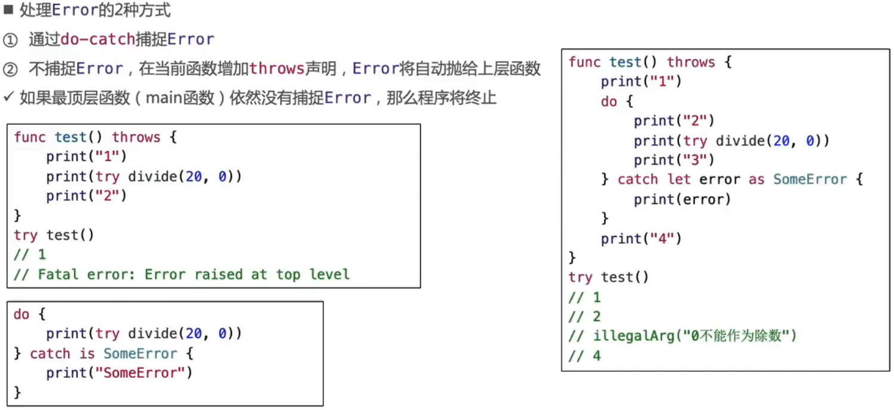

### try?，try!

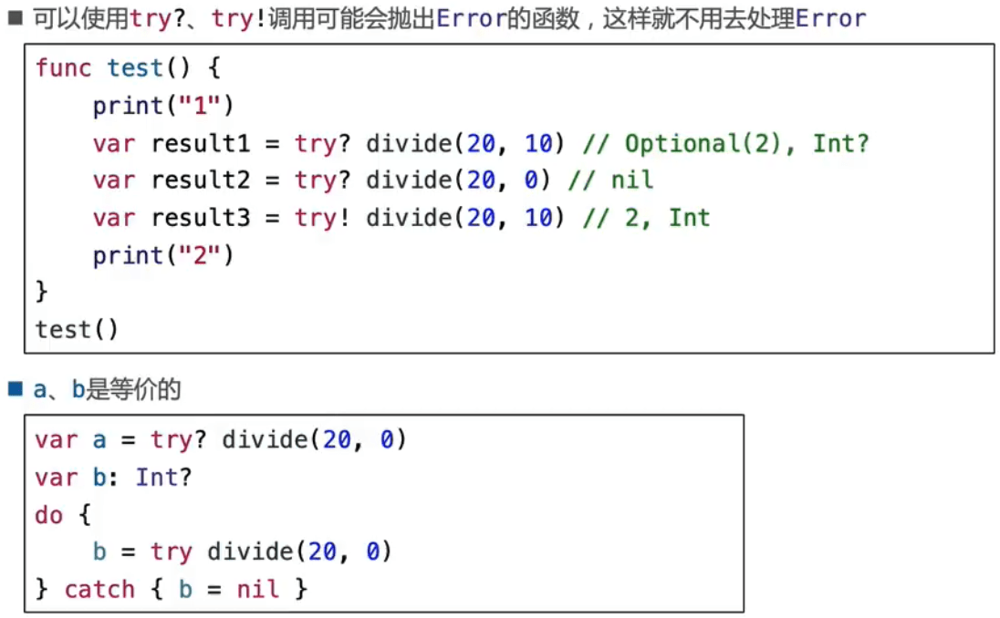

### rethrows

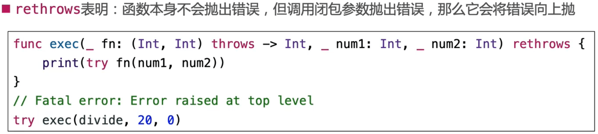

### defer

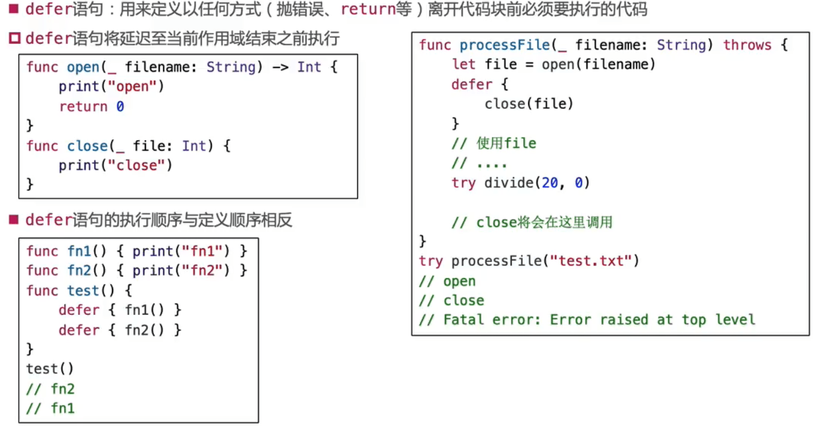

### assert（断言）

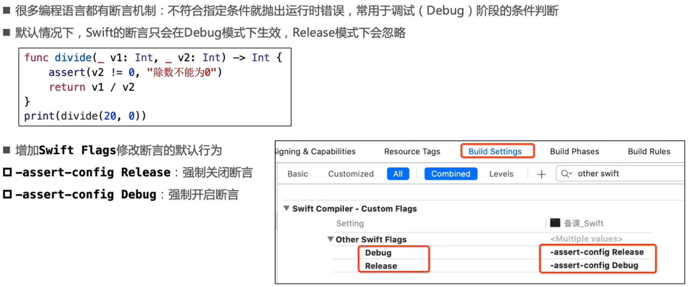

### fatalError

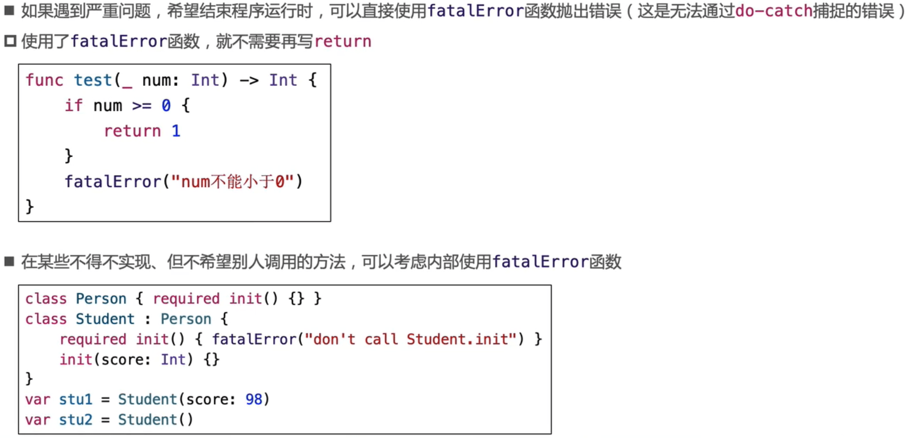

### 局部作用域

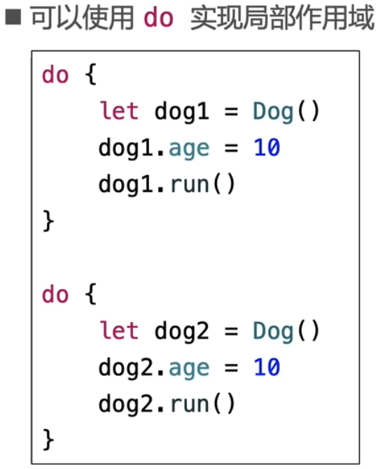

## 泛型

### 泛型( Generics )

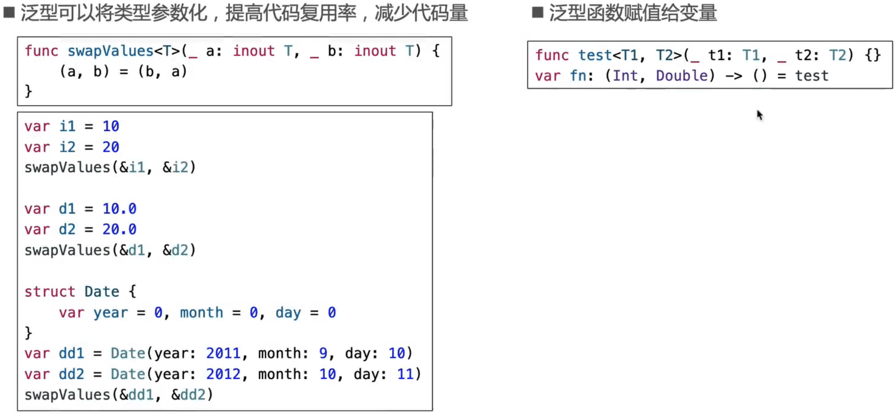

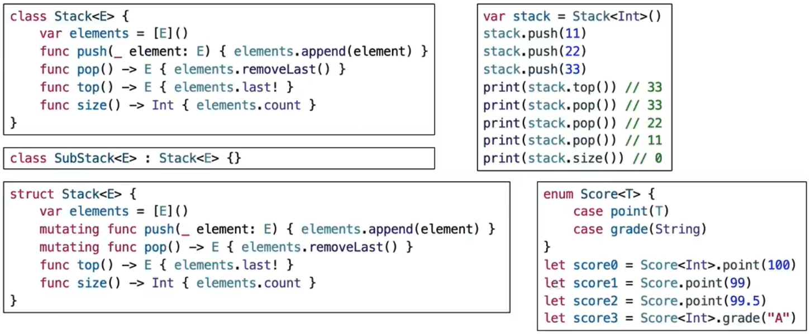

### 关联类型( Associated Type )

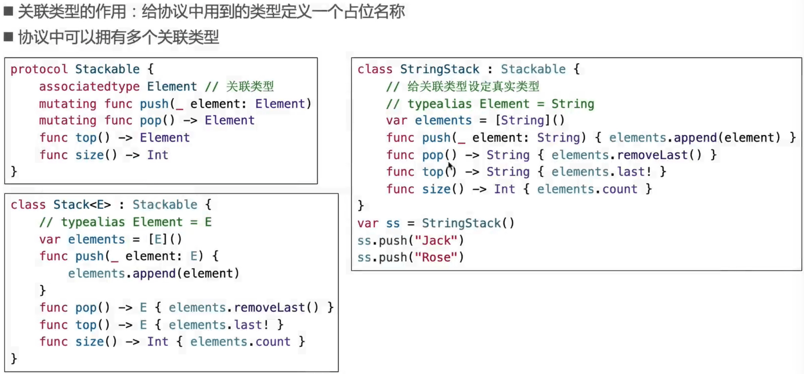

### 类型约束

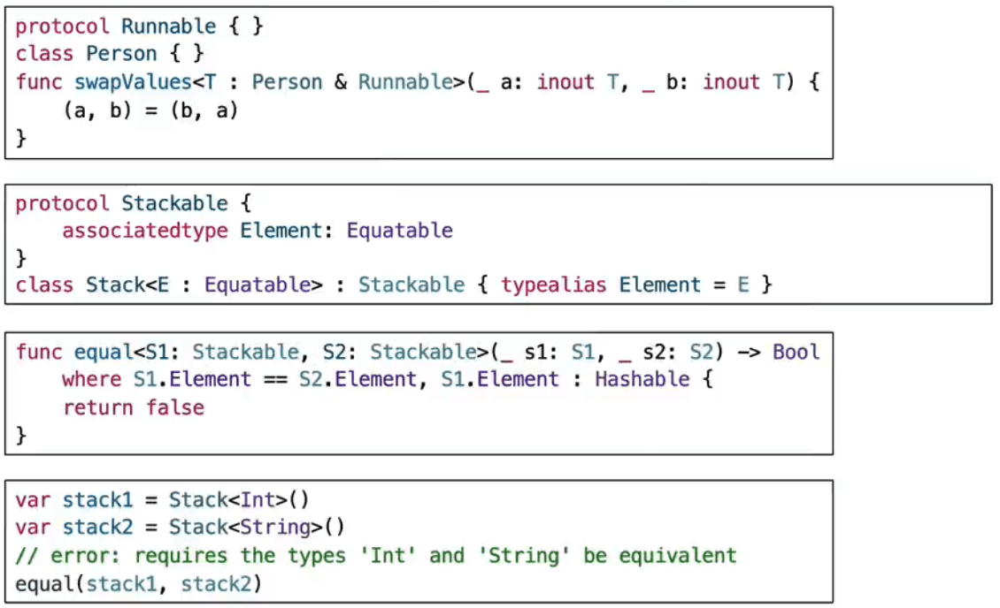

### 不透明类型

#### 协议类型的注意点

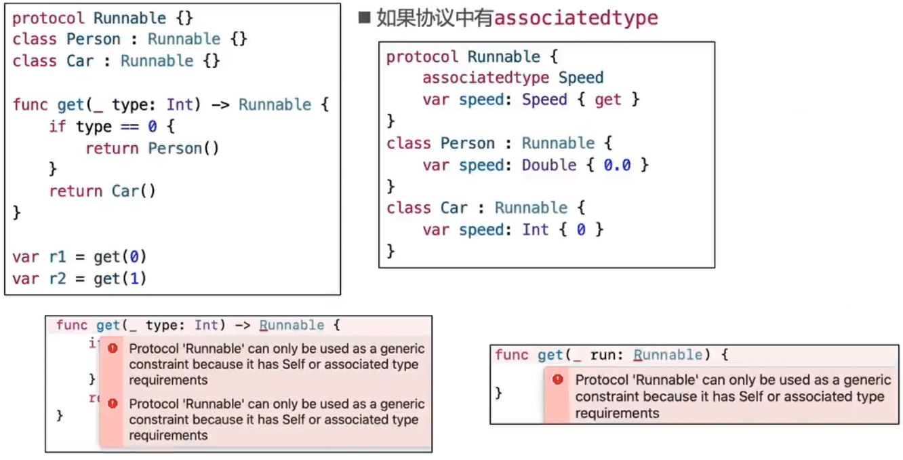

#### 泛型解决

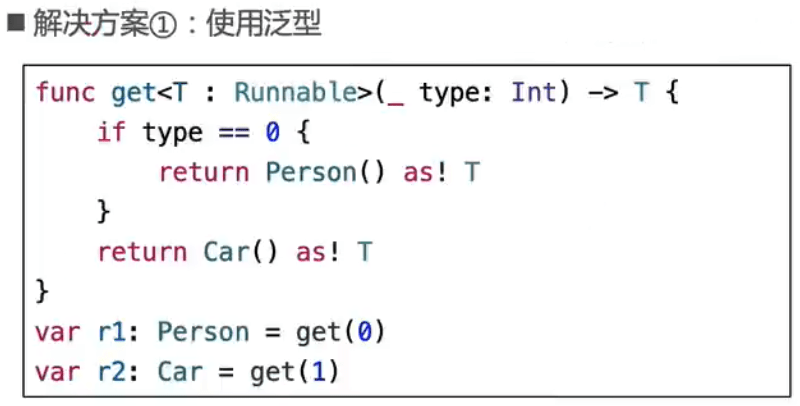

#### 不透明类型

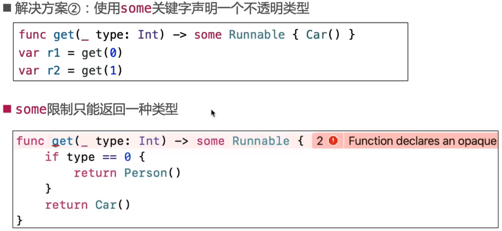

#### some

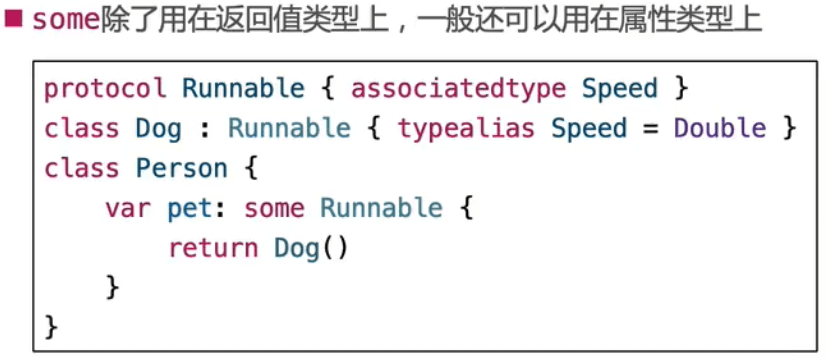

### 可选项的本质

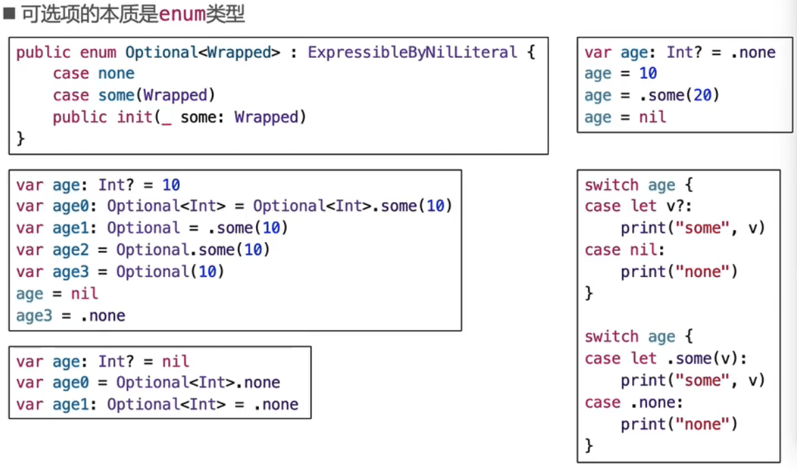

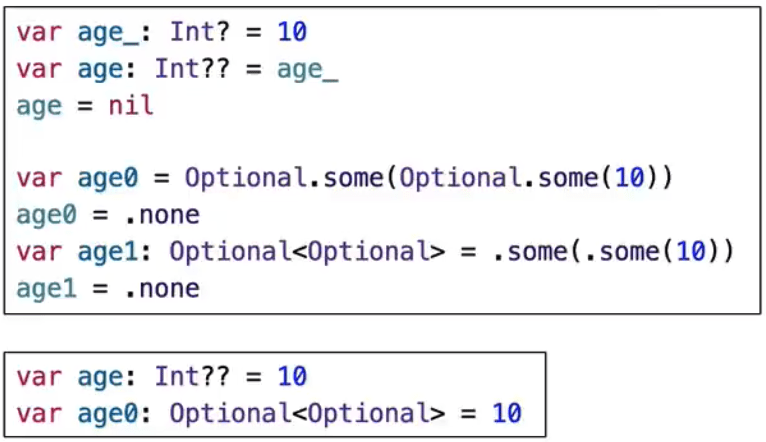

