## 高级运算符

### 溢出运算符( Overflow Operator )

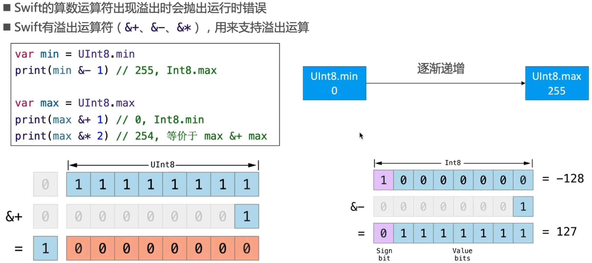

### 运算符重载( Operator Overload )

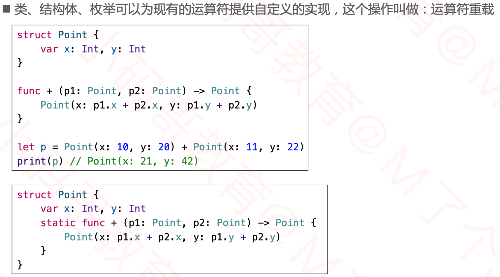

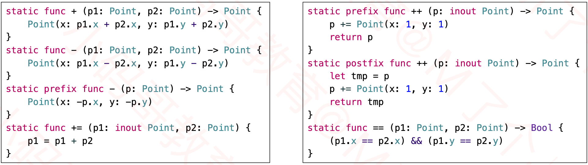

### Equatable

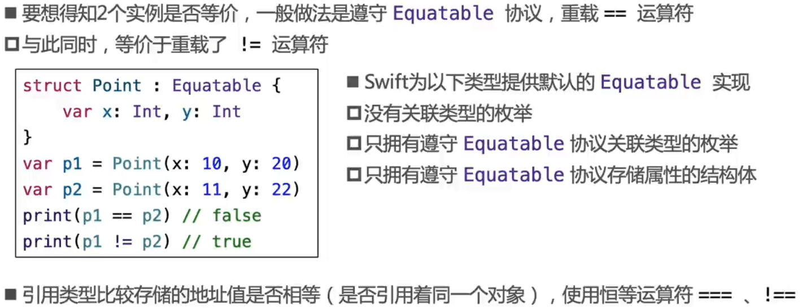

### Comparable

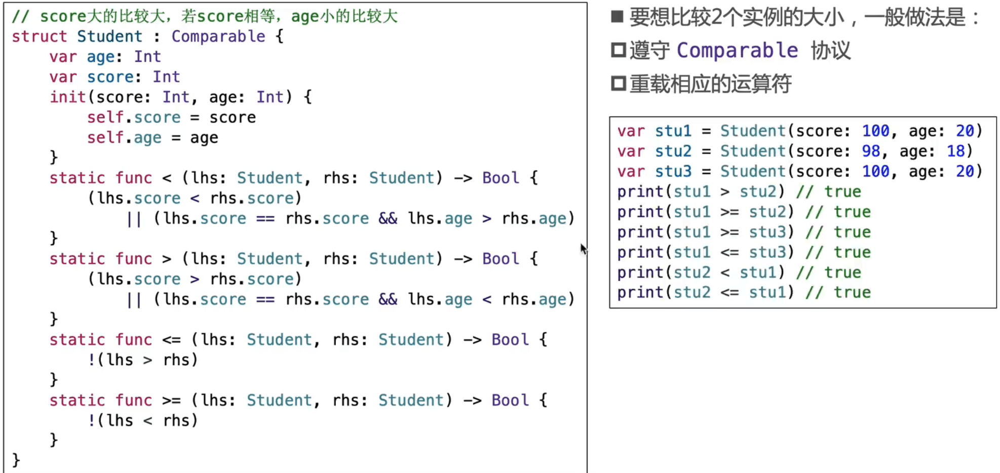

### 自定义运算符( Custom Operator )

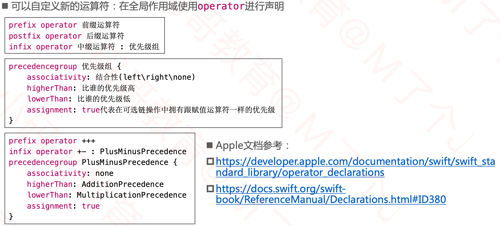

- https://developer.apple.com/documentation/swift/swift_standard_library/operator_declarations
- https://docs.swift.org/swift-book/ReferenceManual/Declarations.html#ID380

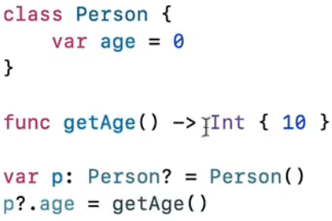

- 如果p为nil = 右边的getAage()不会调用，自定义运算符assignment为ture和赋值运算符一样。

## 扩展( Extension )

- Swift中的扩展，有点类似于0C中的分类( Category )
- 扩展可以为枚举、结构体、类、协议添加新功能
  - 可以添加方法、计算属性、下标、( 便捷)初始化器、嵌套类型、协议等等
- 扩展不能办到的事情
  - 不能覆盖原有的功能
  - 不能添加存储属性，不能向已有的属性添加属性观察器
  - 不能添加父类
  - 不能添加指定初始化器,不能添加反初始化器
  - ...

### 常见使用

#### 计算属性、下标、方法、嵌套类型

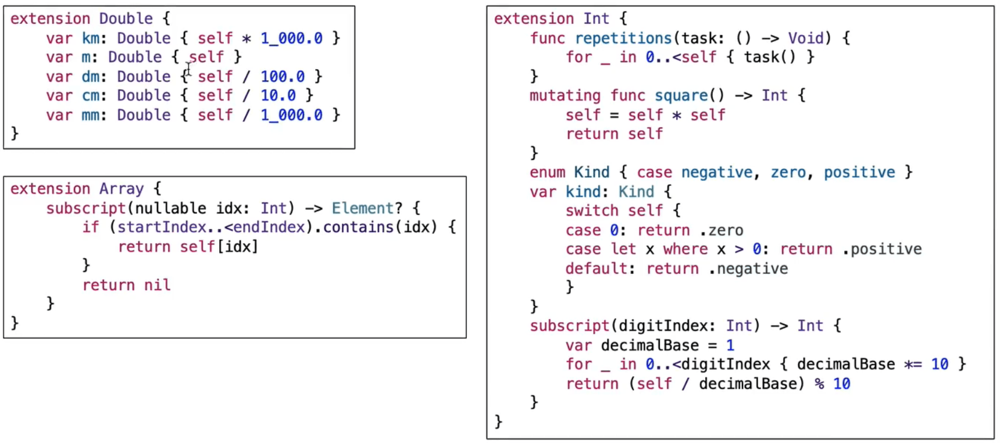

#### 协议、初始化器

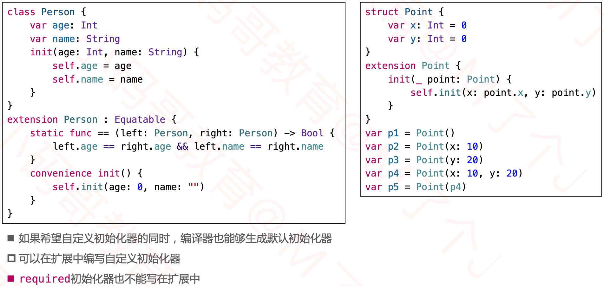

#### 协议

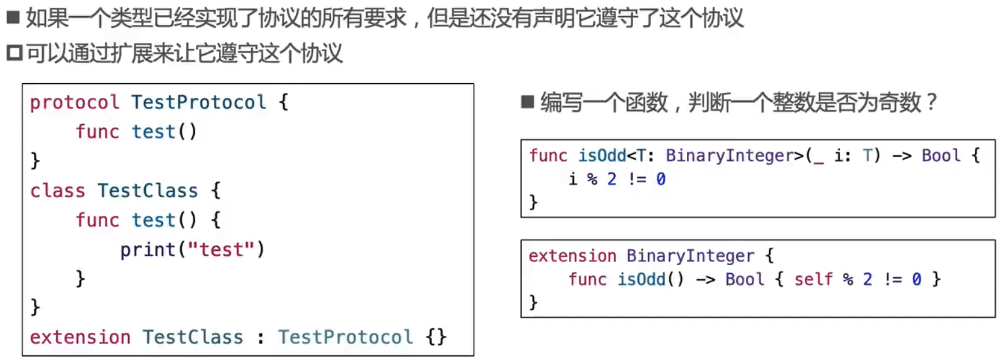

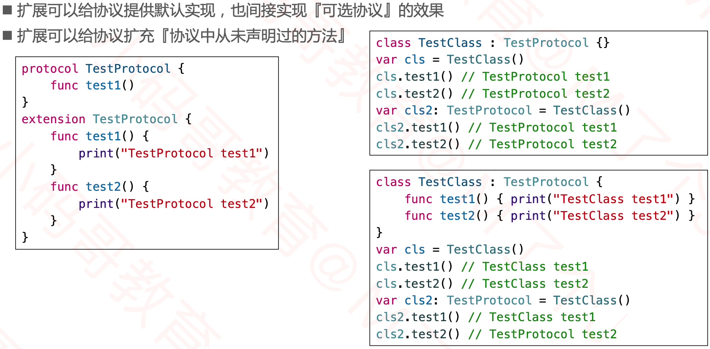

- cls2声明的是TestProtocol类型，TestProtocol声明了test1方法，所以调用类中的，没有申明test2方法，认为class中可能没有实现这个方法，调用协议扩展中的方法。

#### 泛型

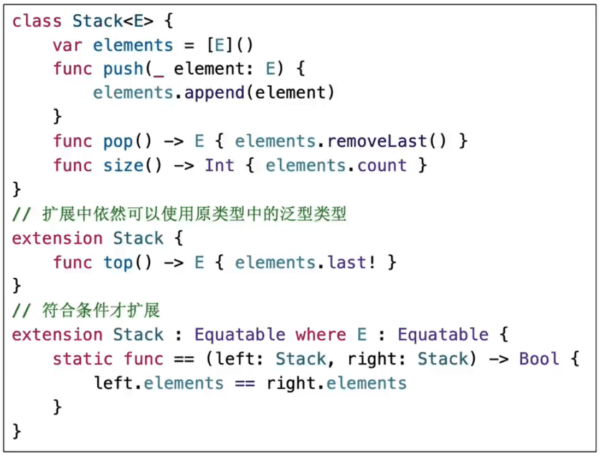