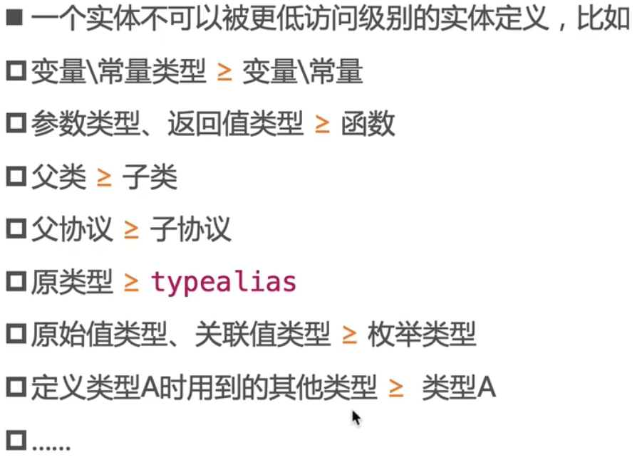

## 访问控制

### 访问控制（access control）


### 访问级别的使用准则



### 元组类型


### 成员

#### 成员、嵌套类型


```swift
//case1
class Test {
  private struct Dog {
    var age: Int = 0
    func run() {}
  }
  
  private struct Person {
    var dog: Dog = Dog()
    mutating func walk() {
      dog.run()
      dog.age = 1
    }
  }
}
//case2
class Test {
  private struct Dog {
    private var age: Int = 0
    private func run() {}
  }
  
  private struct Person {
    var dog: Dog = Dog()
    mutating func walk() {
      dog.run()
      dog.age = 1
    }
  }
}
```

- case1不会报错，Dog成员变量没有显示声明为private，编译器认为其成员变量的private权限和Dog一样，在整个Test作用域内都可以访问
- case2报错，Dog成员变量显示声明为private，编译器认为其成员变量只能在Dog的作用域内被访问。

#### 成员重写


#### 下面代码能否通过编译？


- 第一部分如果定义在一个类内部是不可以的，但如果是全局变量可以。 
- 下左 private sturct Dog相当于 fileprivate struct Dog，其成员变量访问权限为fileprivate，Person中访问不会报错
- 下右 Dog的成员变量访问权限为private，只能在Dog作用域内访问，Person中访问会报错。

#### getter、setter


- getter的访问权限不能比setter低

#### 初始化器


#### 枚举类型的case


#### 协议


- 不能，public成员内部默认是internal 需要在Person中的run前加上public

### 扩展


### 将方法赋值给var\let


## 内存管理


### weak、unowned的使用限制


### Autoreleasepool


### 循环引用(Reference Cycle)


### 闭包

#### 闭包的循环引用


 

####  @escaping


####   逃逸闭包注意点


### 内存访问冲突 (Conflicting Access to Memory)


### 指针


#### 指针的应用场景


#### 获得指向某个变量的指针


#### 获得指向堆空间实例的指针


#### 创建指针


#### 指针直接转换


