## 字面量

### 字面量( Literal )

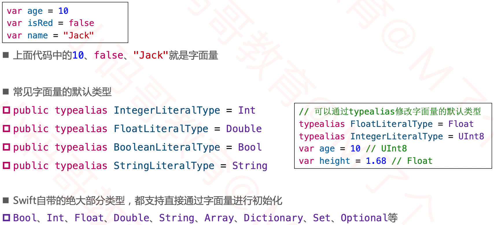

字面量协议

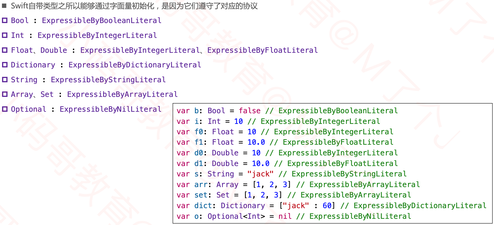

### 字面量协议应用

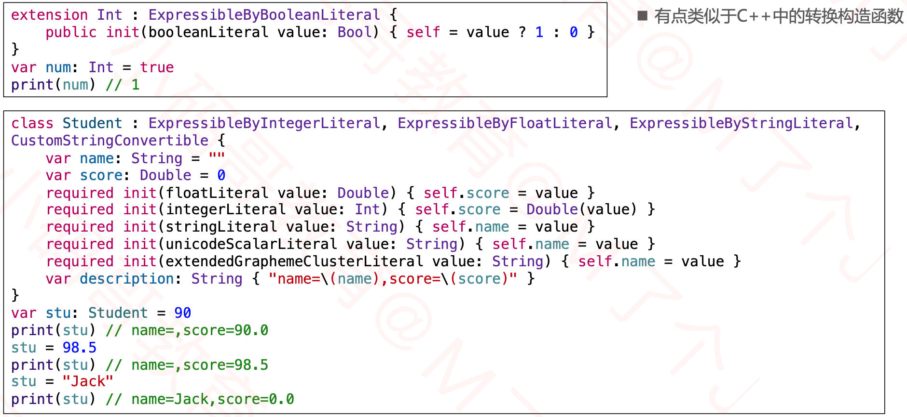

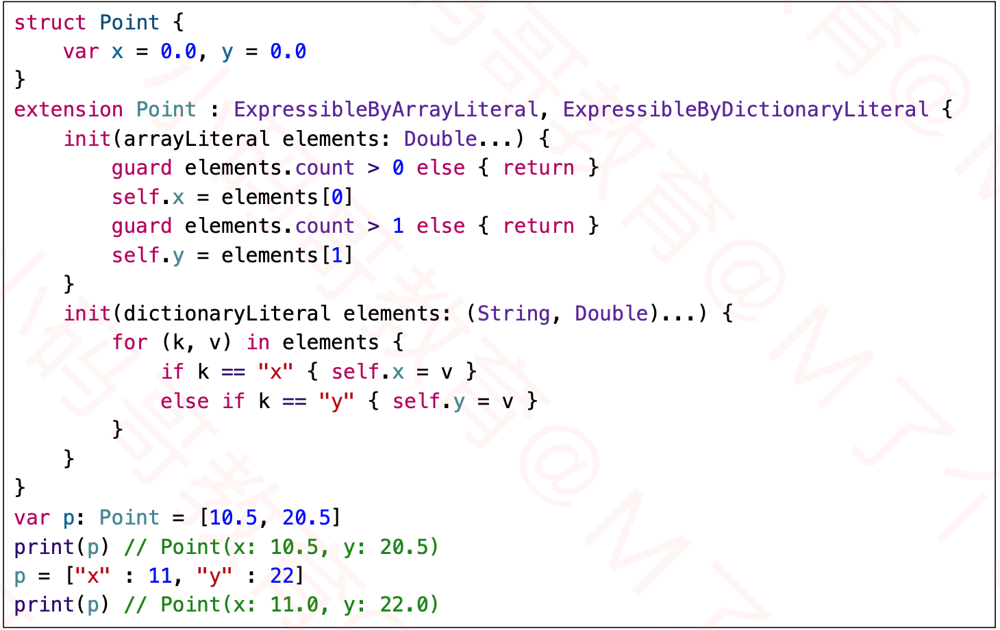

## 模式匹配

### 模式（Pattern）

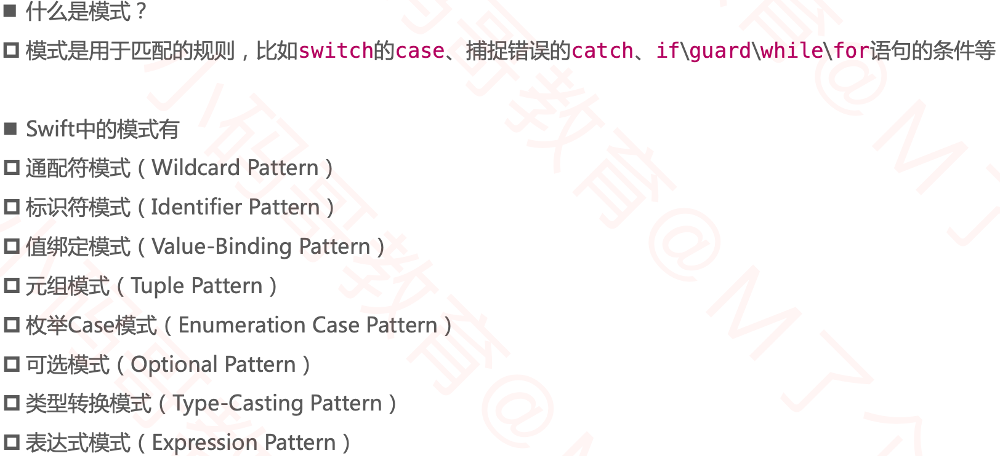

### 通配符模式 ( Wildcard Pattern )

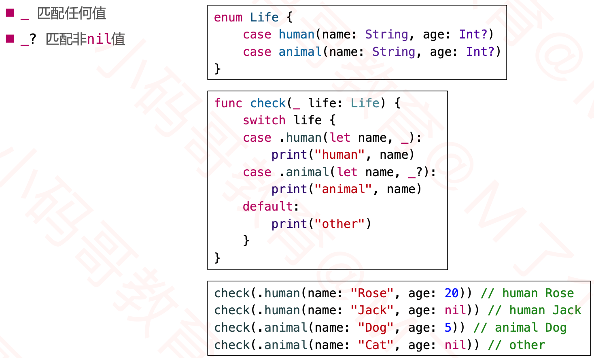

### 标识符模式( Identifier Pattern )

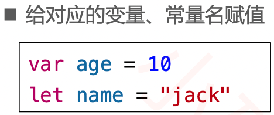

### 值绑定模式( Value-Binding Pattern )

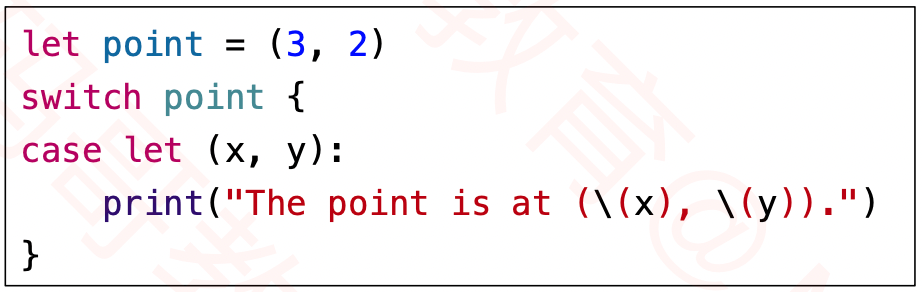

### 元组模式 ( Tuple Pattern )

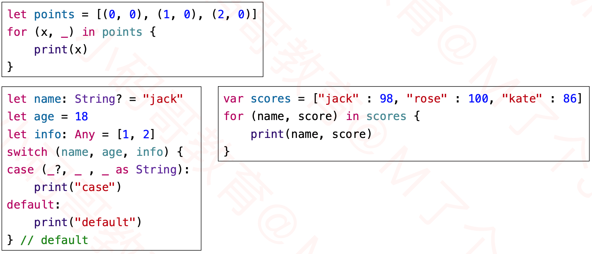

### 枚举case模式 ( Enumeration Case Pattern )

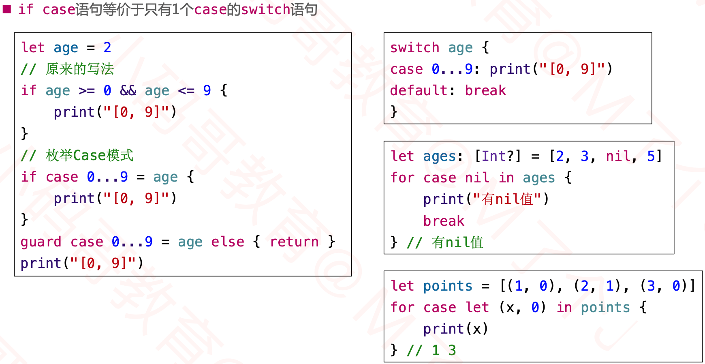

### 可选模式 ( Optional Pattern )

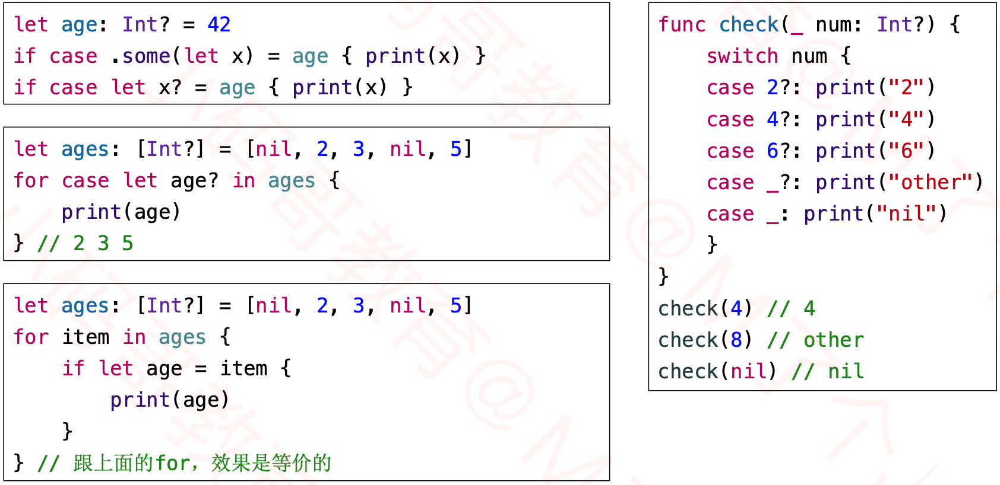

- ？加在类型后面表示可选，其他表示匹配非空。

### 类型转换模式( Type-Casting Pattern )

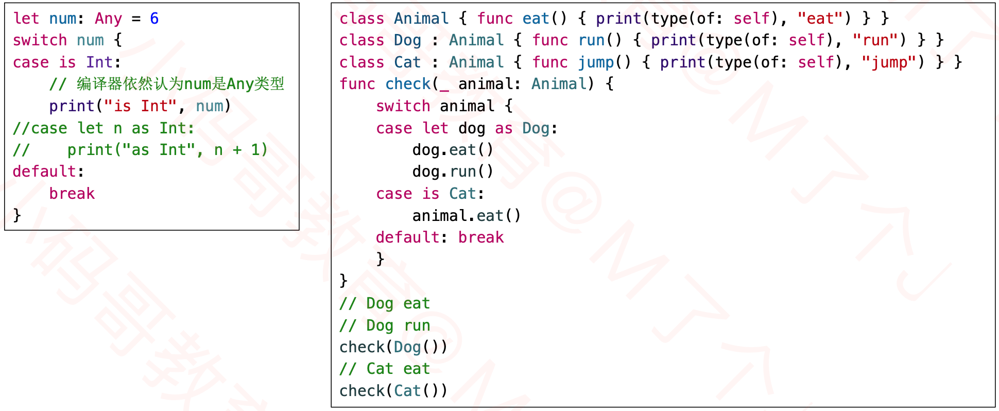

### 表达式模式( Expression Pattern )

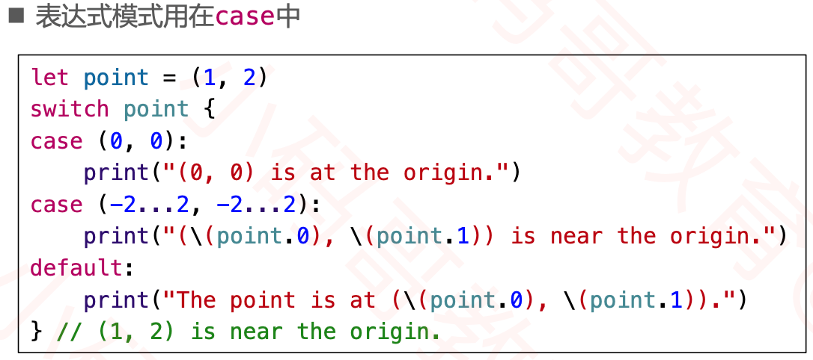

### 自定义表达式模式

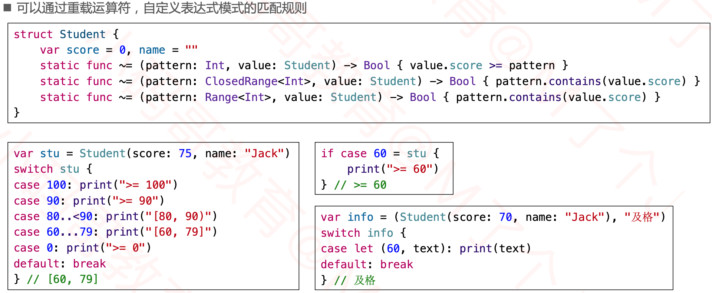

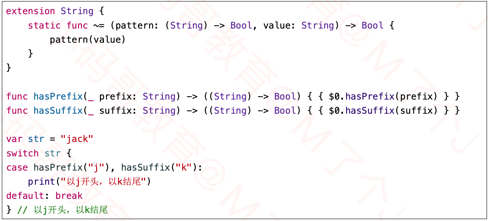

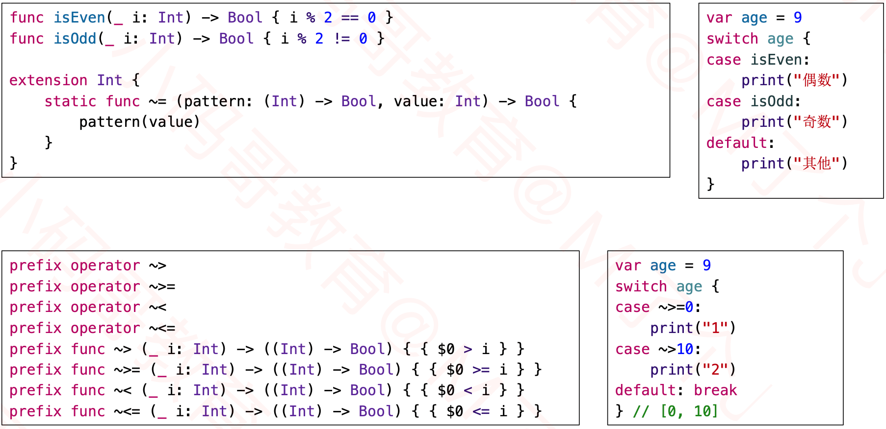

### where

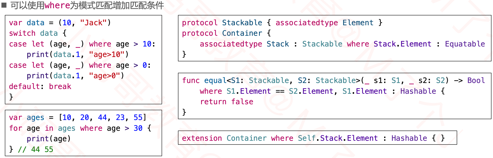

