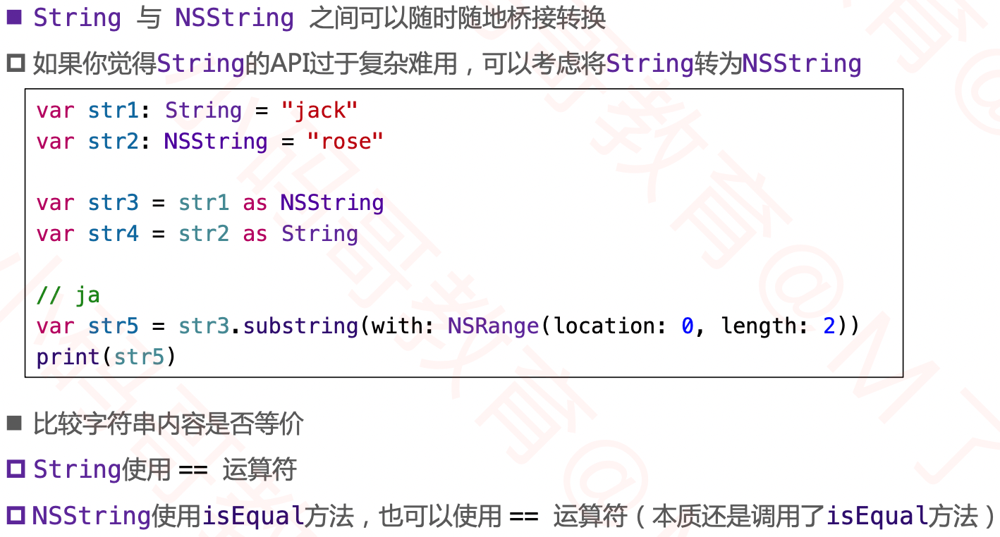

##  从OC到Swift

### MARK、TODO、FIXME

- #warning("message")直接给出警告
- 未完成想以后在写的有返回值的方法（返回值可能是自定义的类，比较复杂），直接写上fatalError()，编译器就不会报错，调用直接抛出异常。

### 条件编译

### 打印

### 系统版本检测

### API可用性说明

- 更多用法参考：[Attributes](https://docs.swift.org/swift-book/ReferenceManual/Attributes.html)

### iOS程序入口

### Swift调用OC

#### MJPerson.h

#### MJPerson.m

#### Swift代码

#### @_ silgen_ name

- 通过这种方式，可以给系统的c语言函数重命名，调用系统方法。

### OC调用Swift

- 可以直接引用头文件，但是在工程中不可见

#### Car.swift

#### {targetName}-Swift.h

#### OC代码

#### @objc

### 选择器( Selector )

### 疑问

1. OC的类大部分都是继承NSObject，需要用到NSObject中的方法。
2. 都是调用objc_msgSend函数。
3. 在swift中调用Swift暴露给OC的方法，依然是安装swift的方式调用，通过汇编查看调用方法
4. 加上给swift暴露给oc的方法加上dynamic关键字，在swift中调用就是走消息发送流程

### 字符串

#### String

#### String的插入和删除

#### Substring

#### String 与 Character

#### String相关的协议

#### 多行String

#### String 与 NSString

#### Swift、OC桥接转换表

### 协议

#### 只能被Class继承的协议

#### 可选协议

### dynamic

### KVC/KVO

#### block方式的KVO

### 关联对象（Associated Object）

- Void?和boolean一样只占一个字节，也可以写成boolean。只需要其地址，占用内存越小越好，

### 资源名管理

- https://github.com/mac-cain13/R.swift
- https://github.com/SwiftGen/SwiftGen

### 多线程开发

#### 异步

#### 延迟

#### 异步延时

#### once

- 通过汇编可以看到底层用的dispatch_once加载，而且是lazy加载，用到时才初始化。

#### 加锁

