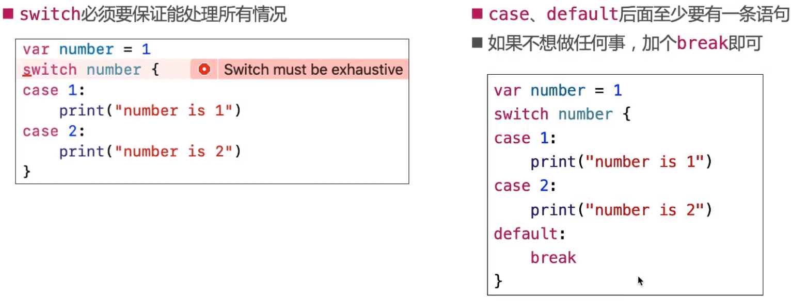
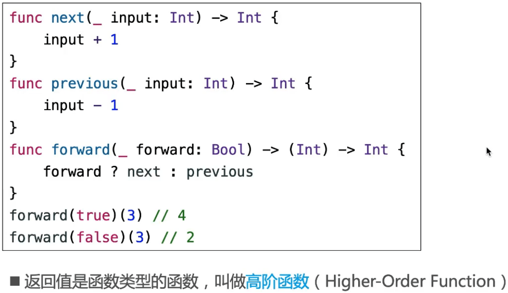

## 流程控制

### if-else

### while

### for

#### 区间运算符用在数组上

#### 区间类型

### 带间隔的区间值

### Switch

#### fallthrough

#### switch注意点

#### 复合条件

#### 区间匹配、元组匹配

#### 值绑定

#### where

### 标签语句

## 函数

### 函数的定义

### 返回值

#### 隐式返回 ( Implicit Return )

#### 返回元组：实现多返回值

### 函数的文档注释

### 参数

#### 参数标签（Argument Label ）

- at给函数外看增强可读性，time在函数内使用
- func goToWork(atTime : String) {} 参数标签和参数名相同，都是atTime

#### 默认参数值（Default Parameter Value）

#### 可变参数（Variadic Parameter）

#### Swift自带的print函数

####  输入输出参数（In-Out Parameter)

### 函数重载

#### 函数重载( Function Overload )

#### 函数重载注意点

### 内联函数 ( Inline Function )

#### @inline

### 函数类型（Function Type）

### 函数类型作为函数参数

### 函数类型作为函数返回值

### typealias

### 嵌套函数 ( Nested Function )

