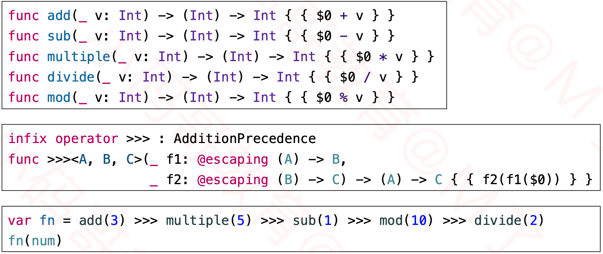

## 函数式编程

### Array

#### Array的常见操作

#### lazy的优化

- 使用的时候才进行映射

#### Optional的map和flatMap

### FP

#### 函数式编程 ( Funtional Programming )

-  参考资料
  - http://adit.io/posts/2013-04-17-functors,_applicatives,_and_monads_in_pictures.html
  - http://www.mokacoding.com/blog/functor-applicative-monads-in-pictures

#### 传统写法

#### 函数式写法

#### 高阶函数( Higher-Order Function )

#### 柯里化( Currying )

#### 函子( Functor )

#### 适用函子（Applicative Functor ）

#### 单子( Monad )

- Array的flatmap进行柯里化处理，本质是接受两个参数的函数。