## 面向协议编程

### 面向协议编程（Protocol Oriented Programming）

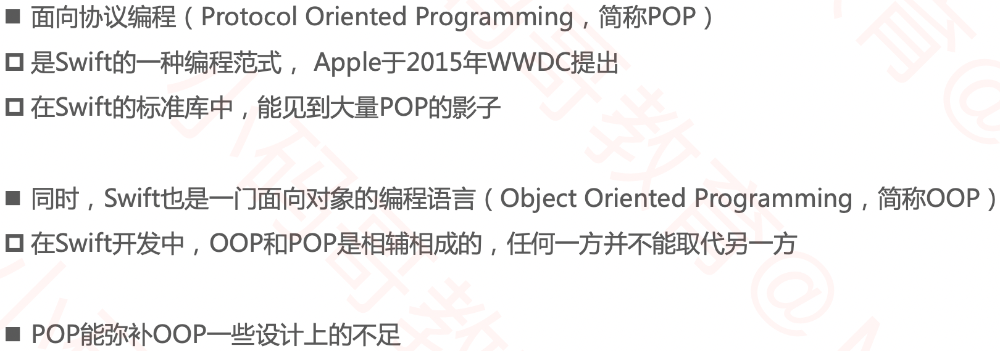

### 回顾OOP

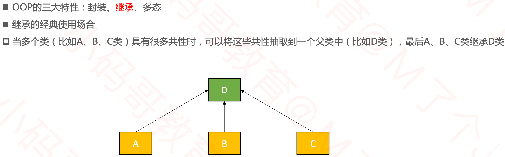

### OOP的不足

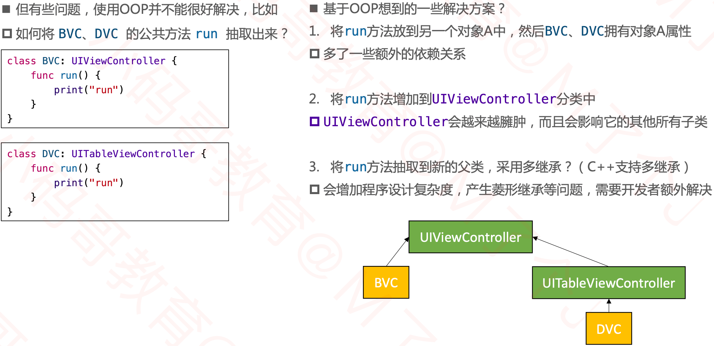

### POP的解决方案

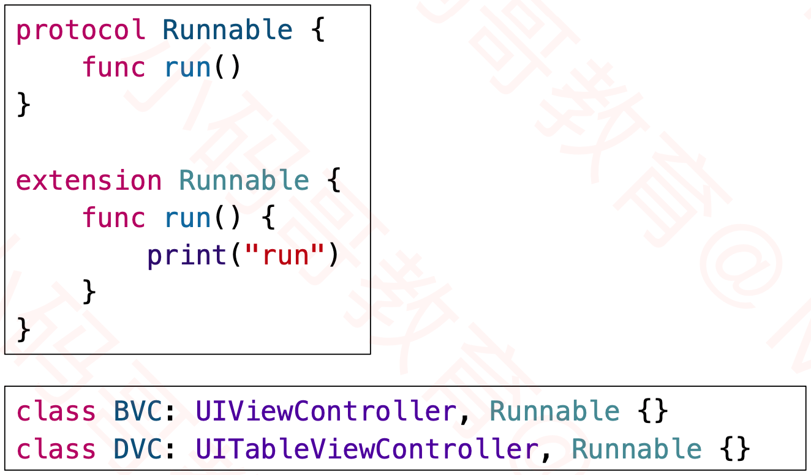

### 再举例

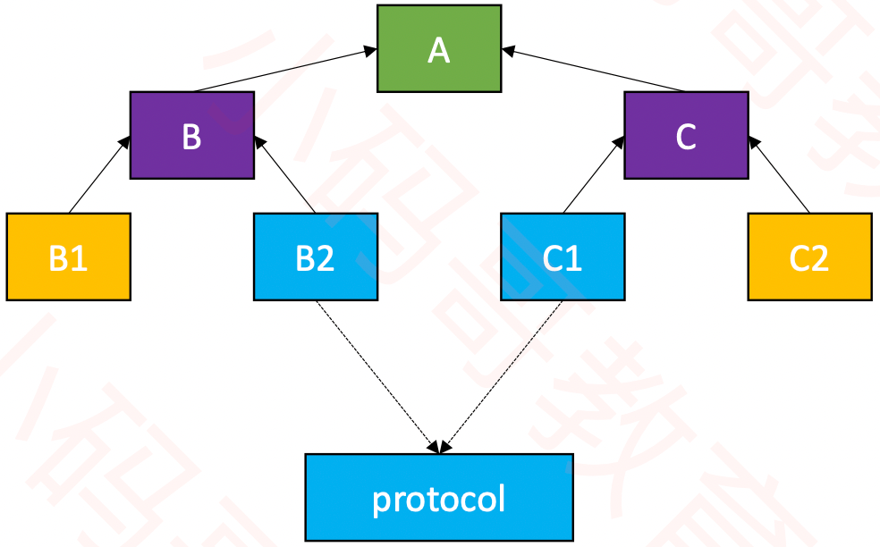

### POP的注意点

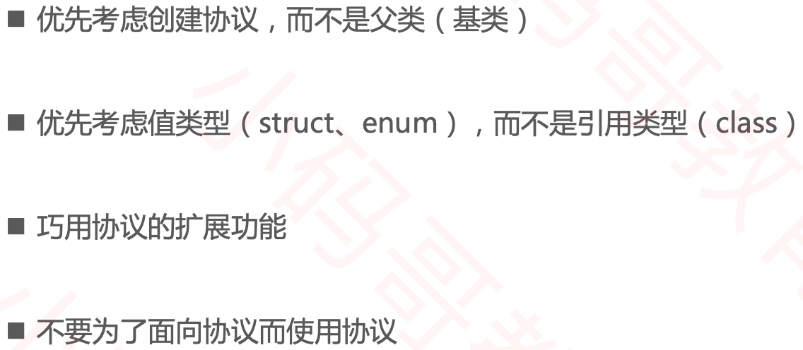

### 利用协议实现前缀效果

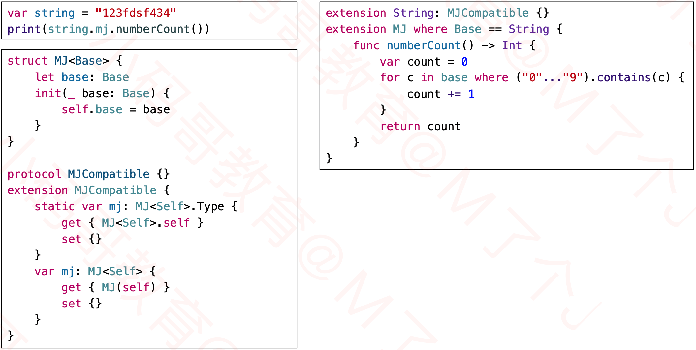

### Base:类

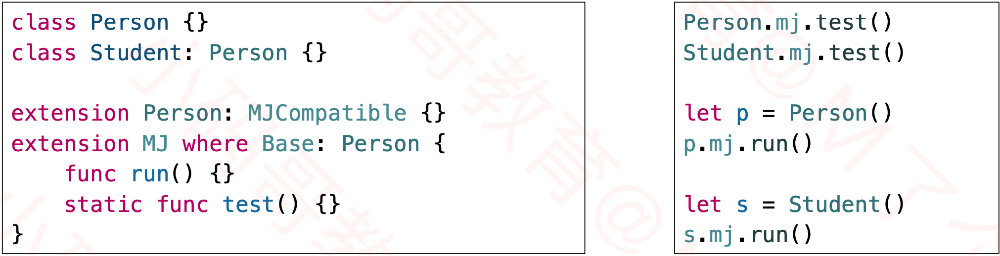

### Base:协议

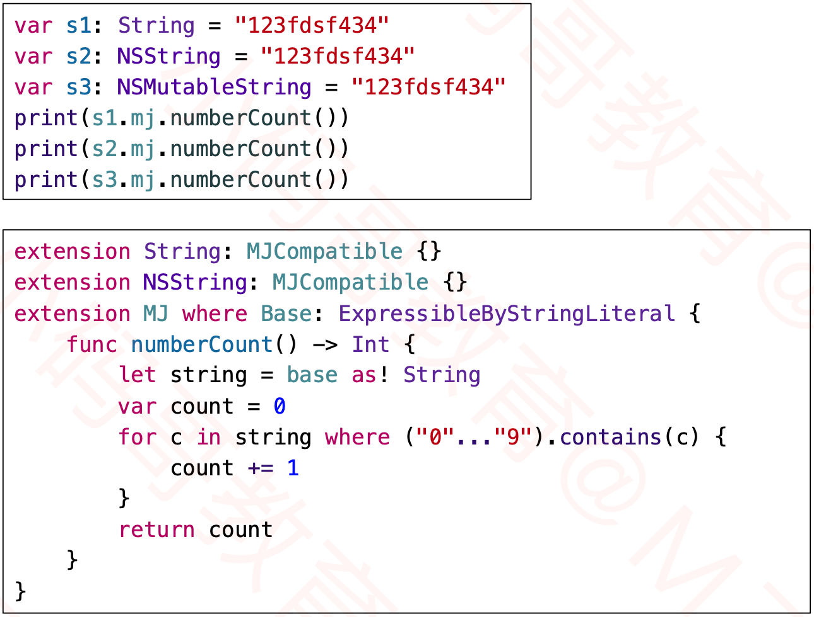

### 利用协议实现类型判断

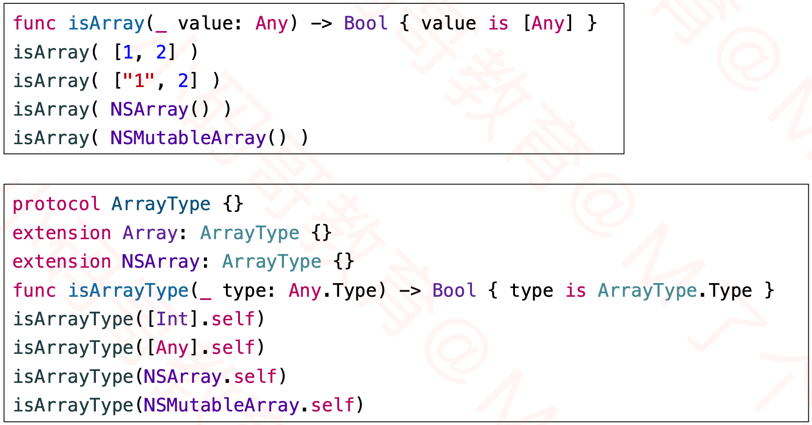

## 响应式编程

### 响应式编程（Reactive Programming）

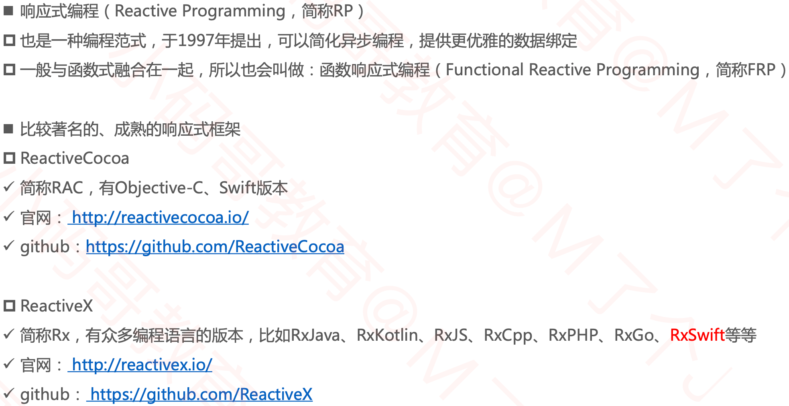

### RxSwift

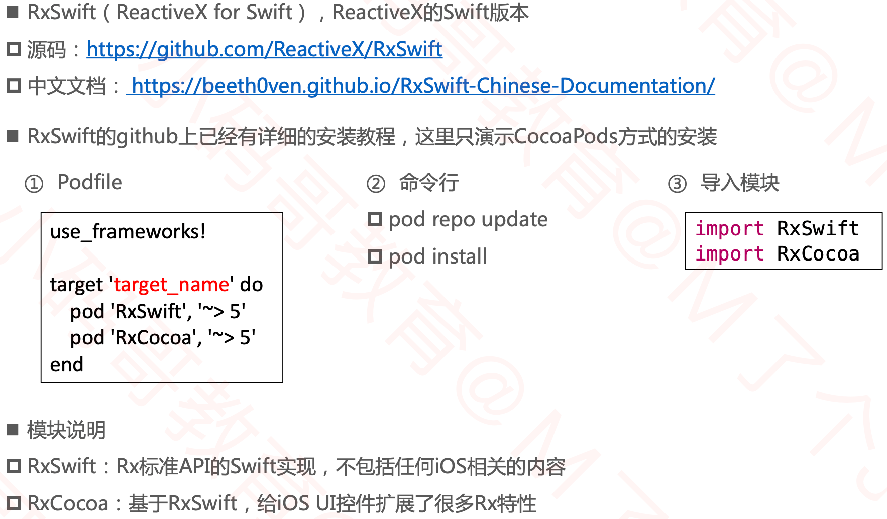

### RxSwift的核心角色

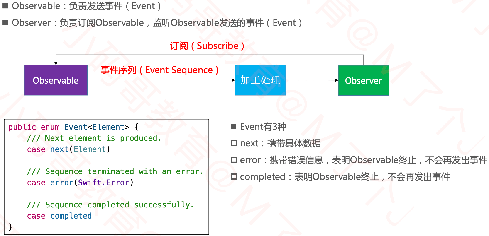

### 创建、订阅Observable

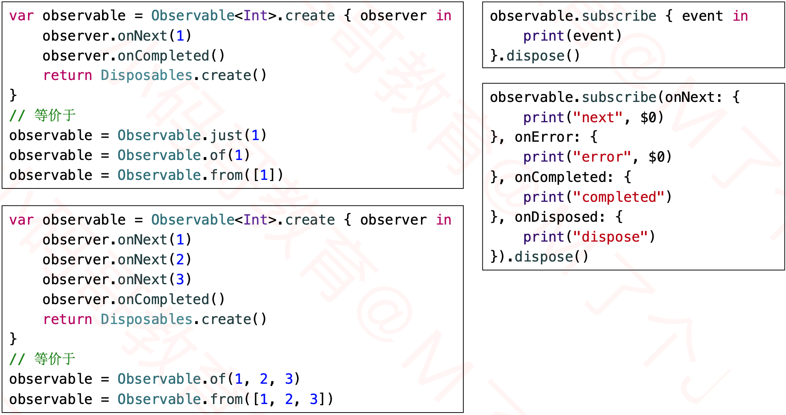

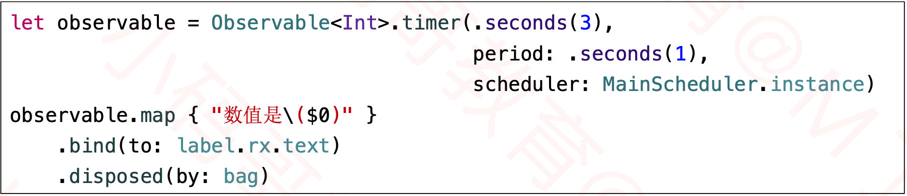

### 创建Observer

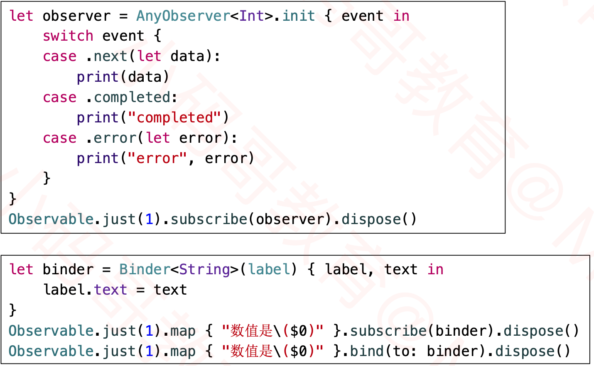

### 扩展Binder属性

### 传统的状态监听

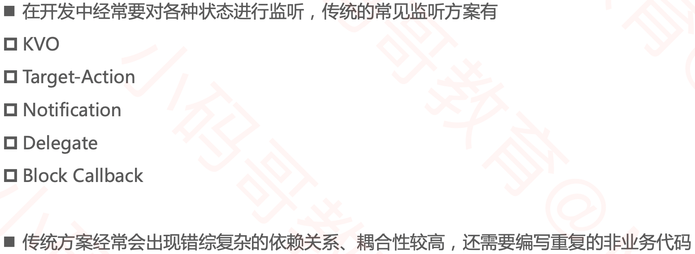

### RxSwift的状态监听

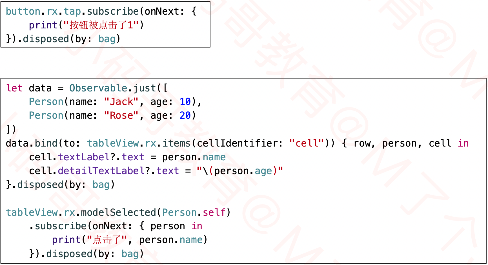

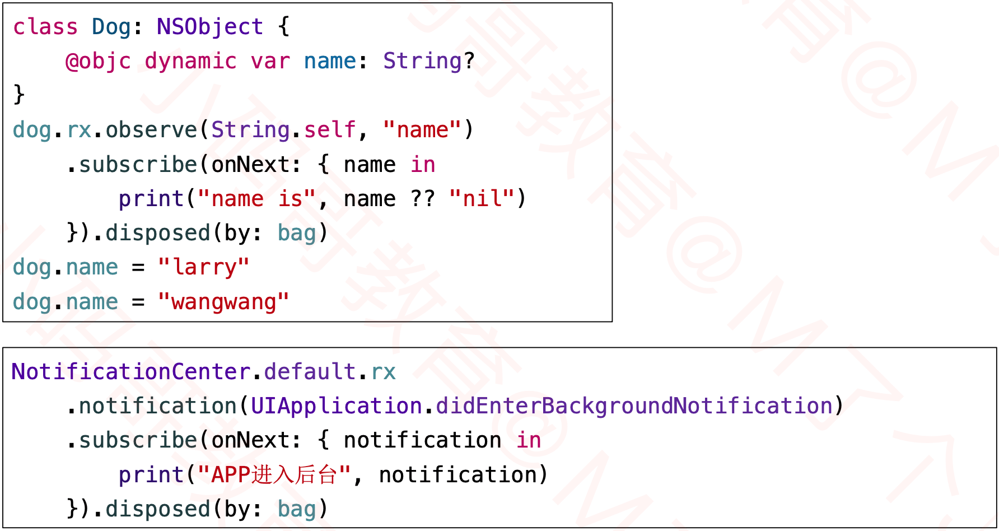

### 既是Observable , 又是Observer

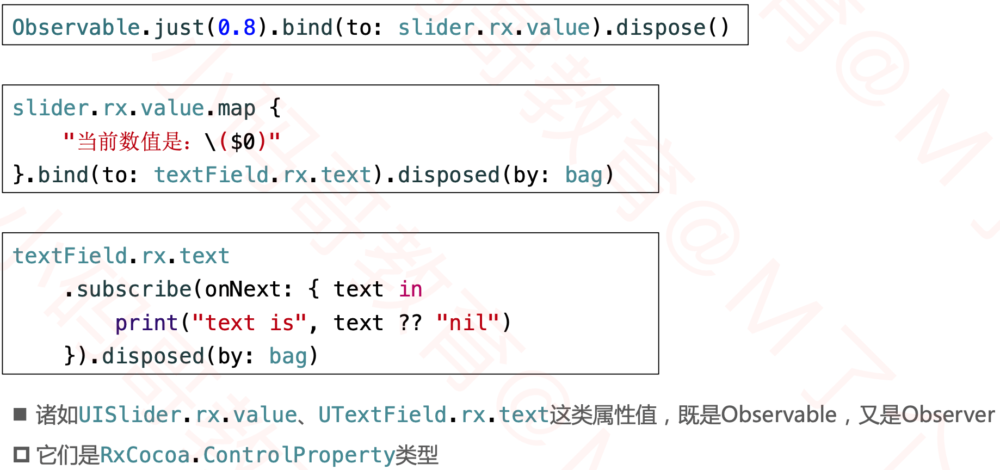

### Disposable

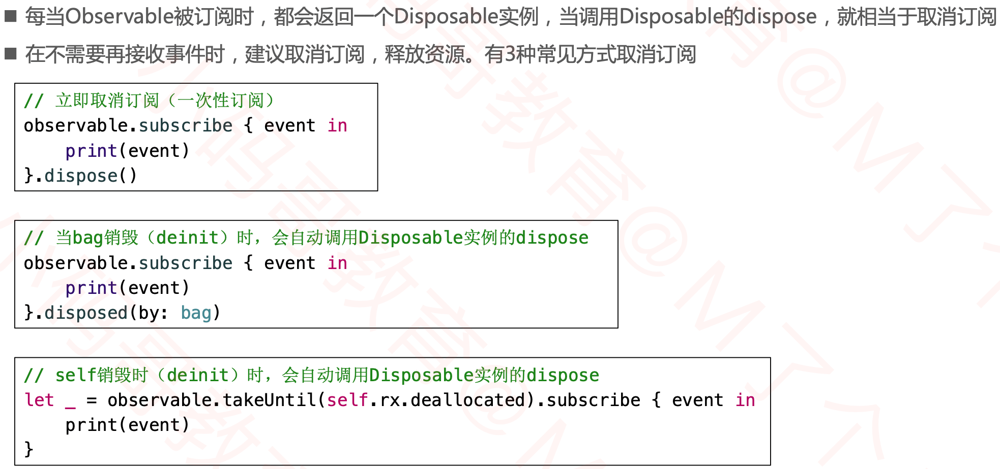

