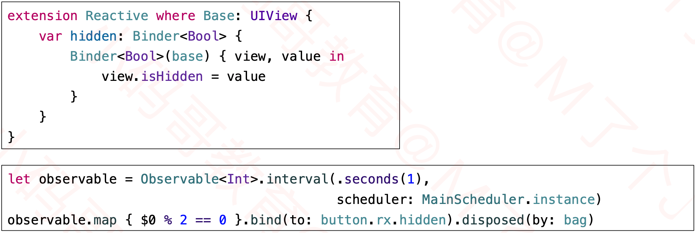

## 面向协议编程

### 面向协议编程（Protocol Oriented Programming）

### 回顾OOP

### OOP的不足

### POP的解决方案

### 再举例

### POP的注意点

### 利用协议实现前缀效果

### Base:类

### Base:协议

### 利用协议实现类型判断

## 响应式编程

### 响应式编程（Reactive Programming）

### RxSwift

### RxSwift的核心角色

### 创建、订阅Observable

### 创建Observer

### 扩展Binder属性

### 传统的状态监听

### RxSwift的状态监听

### 既是Observable , 又是Observer

### Disposable

