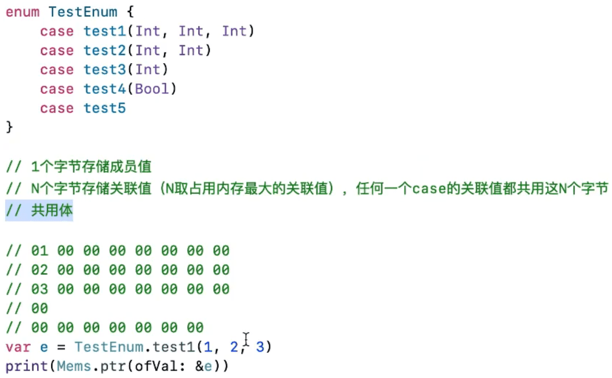

## 枚举

### 枚举的基本用法

### 关联值( Associated Values )

- case let .points(i) 与case .point(let i)等价

#### 关联值举例

### 原始值（Raw Value）

#### 隐式原始值 ( Implicitly Assigned Raw Values )

### 枚举递归 （Recursive Enumeration )

### MemoryLayout

#### 思考下枚举变量的内存布局

- 多个case才会再用一个字节存储成员值

- Mems打印一个变量的地址，通过View Memory查看内存信息。
- ARM芯片是小端模式，遵循高高低低模式（高地址存储高位，低地址存储地位）

#### 进一步观察下列枚举的内存布局

## 可选项

### 强制解包( Forced Unwrapping )

### 判断可选值是否包含值

 

### 可选项绑定( Optional Binding )

### 等价写法

### while循环中使用可选项绑定

### 空合并运算符 ?? ( Nil-Coalescing Operator )

#### 多个??一起使用

#### ??跟if let配合使用

### guard

#### guard语句

### 隐式解包( Implicitly Unwrapped Optional )

### 字符串插值

###  多重可选项

