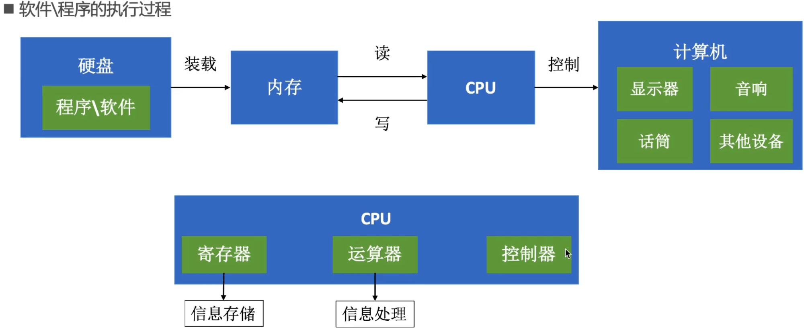
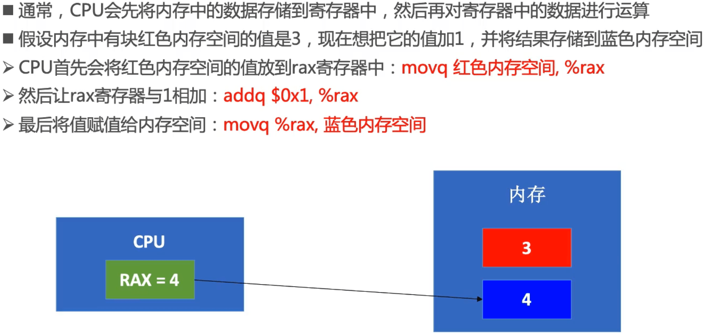
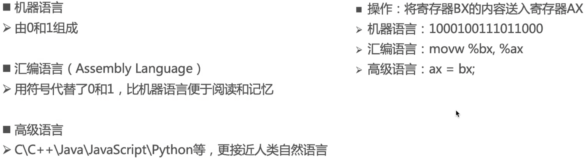
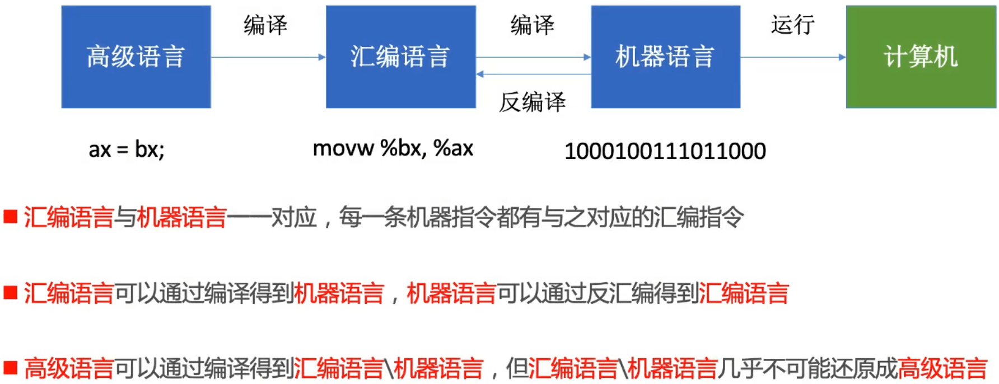
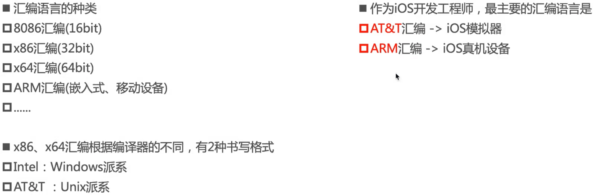
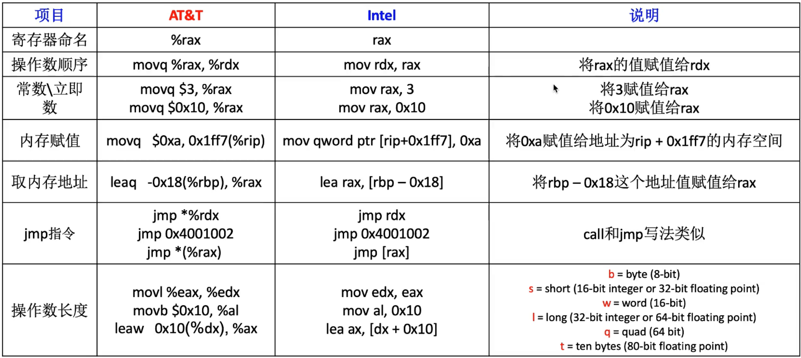
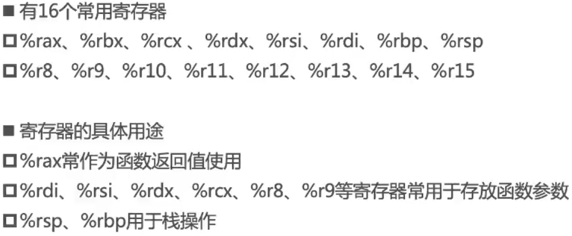
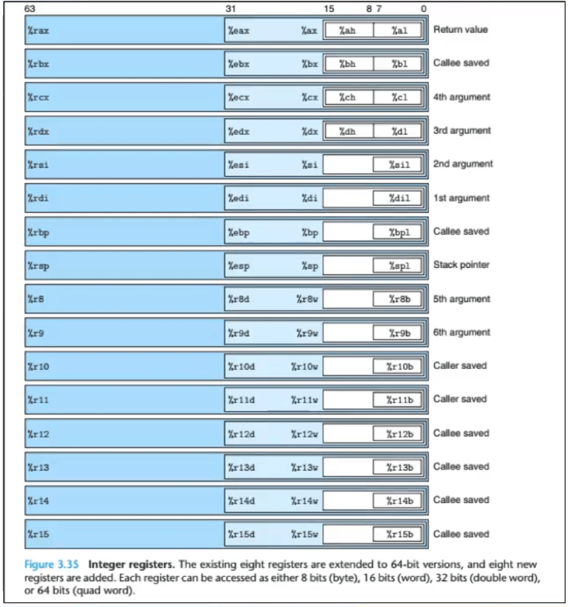
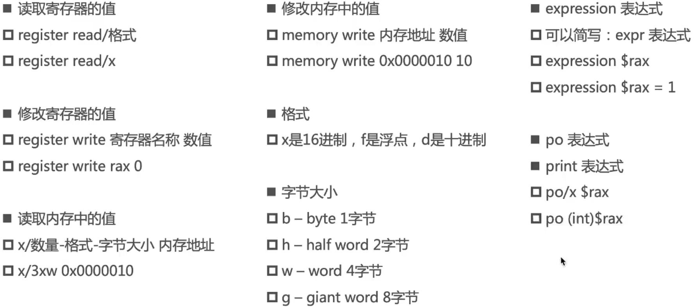
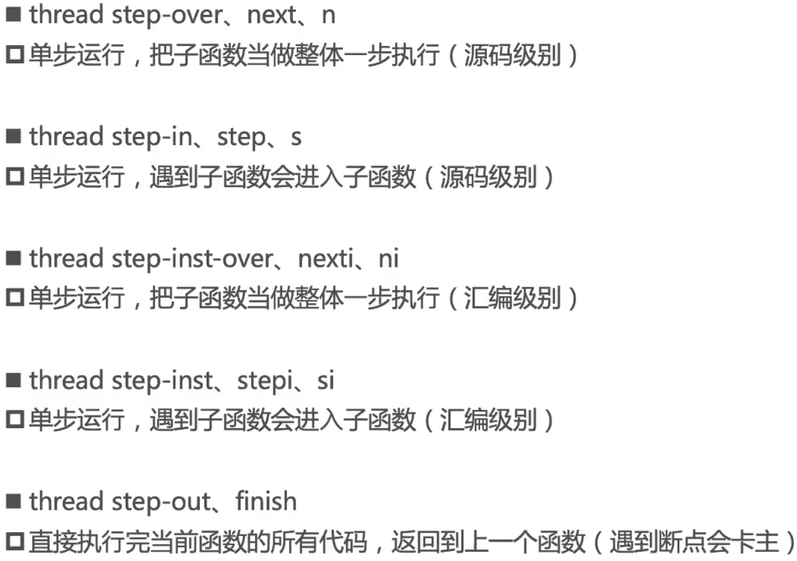

## 汇编语言

### 程序的本质

### 寄存器与内存

### 编程语言的发展史

### 汇编语言的种类

### 常见汇编指令

### 寄存器

### 规律

- 内存地址格式为: 0x4bdc(%rip) ，一般是全局变量，全局区(数据段)
- 内存地址格式为: -0x78(%rbp) ，一般是局部变量，栈空间
- 内存地址格式为: 0x10(%rax) ，一般是堆空间

## Ildb常用指令

