## 结构体

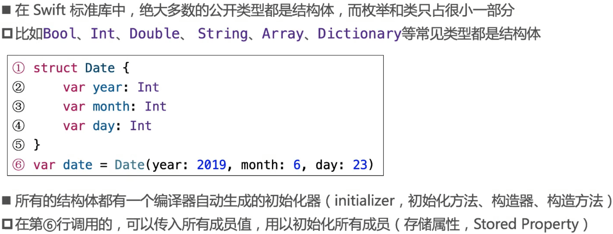

### 结构体的初始化器

### 思考：下面代码能编译通过么？

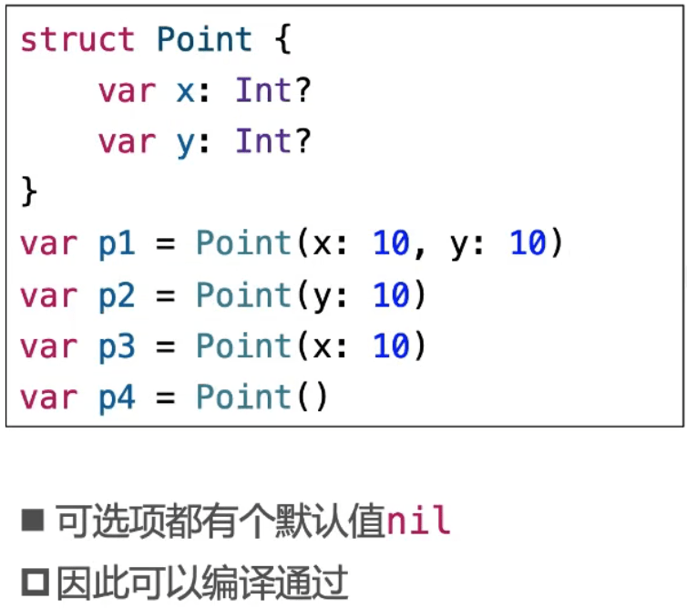

### 自定义初始化器

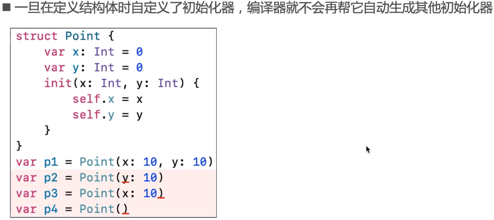

### 窥探初始化器的本质

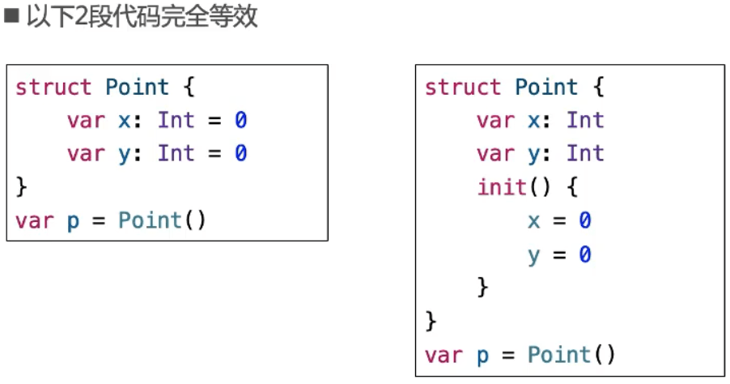

### 结构体内存结构

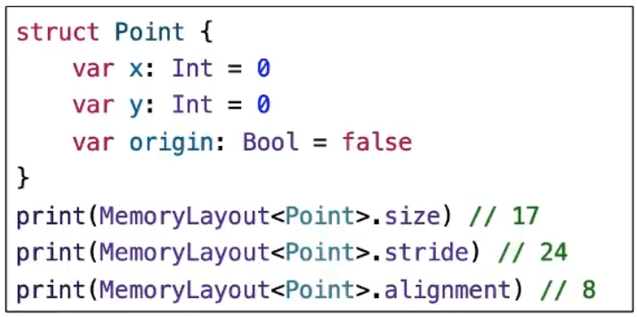

## 类

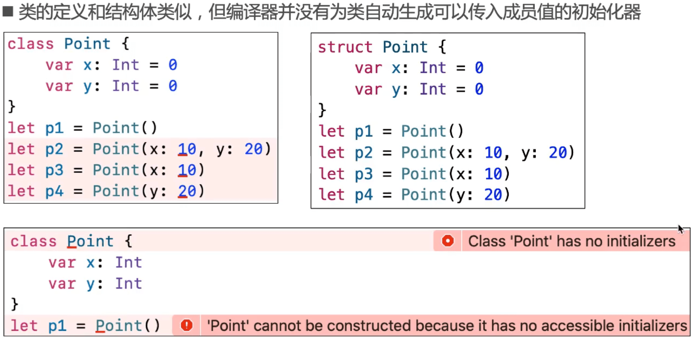

### 类的初始化器

### 结构体与类的本质区别

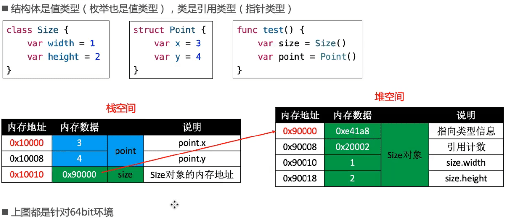

### 对象的堆空间申请过程

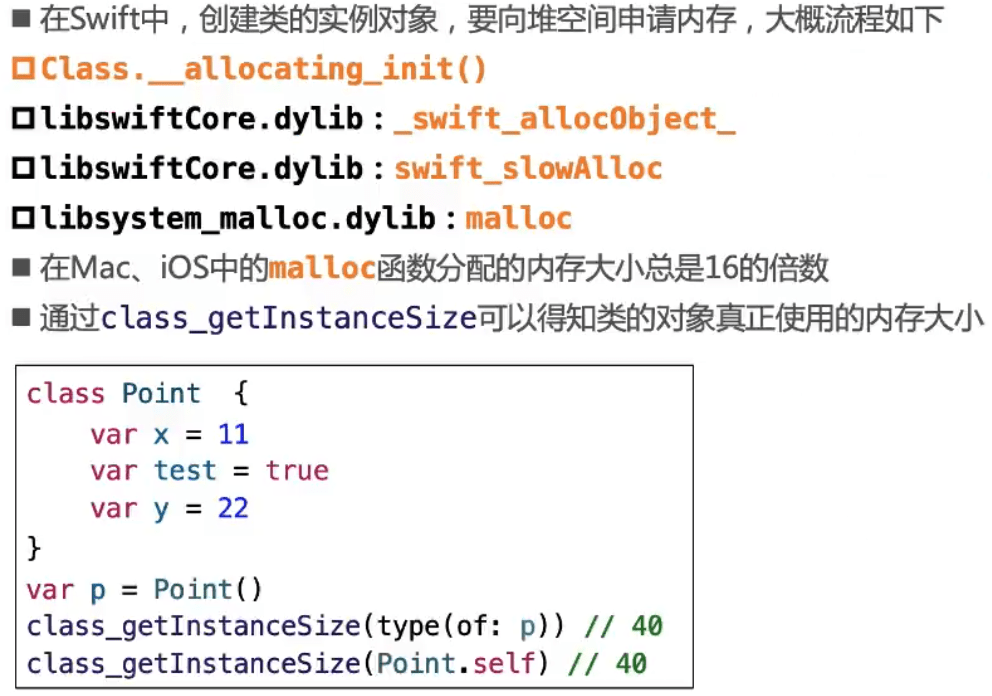

### 值类型

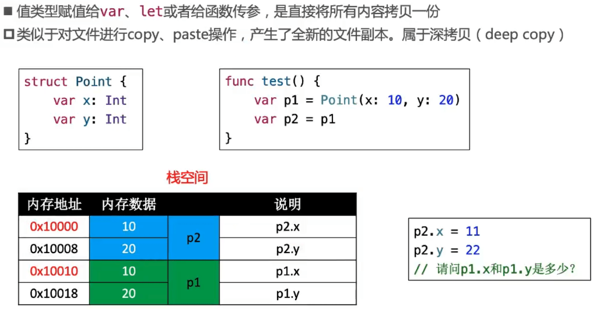

#### 值类型的赋值操作

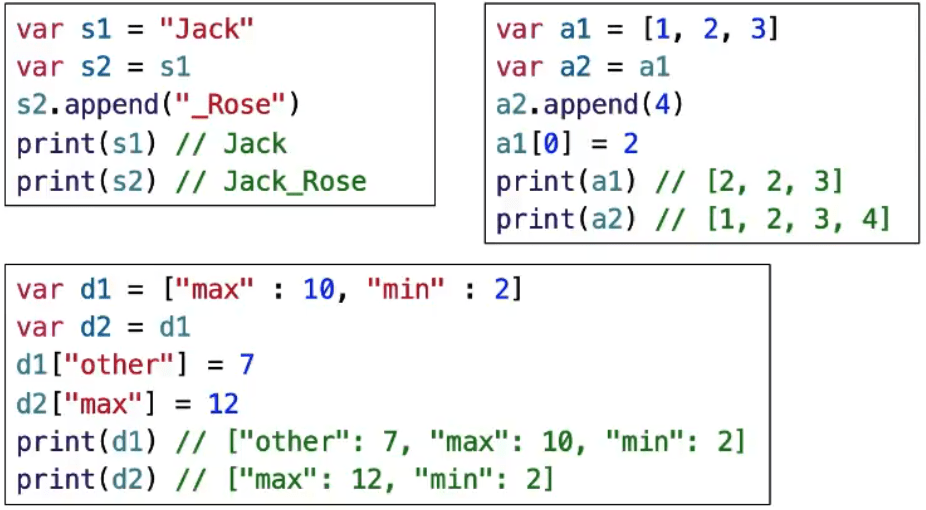

- 在Swift标准库中，为了提升性能, String、Array、 Dictionary、 Set采取了Copy On Write技术
  - 比如仅当有"写” 操作时，才会真正执行拷贝操作
  - 对于标准库值类型的赋值操作，Swift能确保最佳性能，所有没必要为了保证最佳性能来避免赋值
- 建议:不需要修改的,尽量定义成let

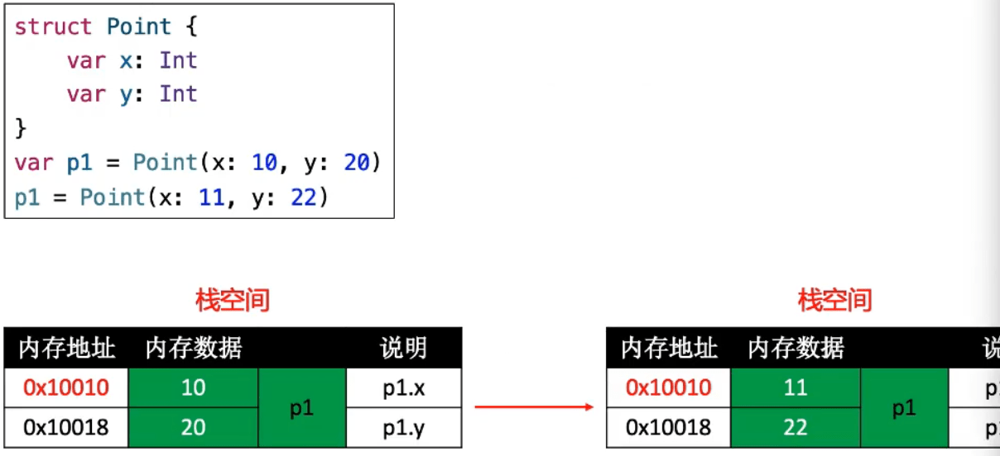

- 值类型赋值，内存地址不变，只修内存数据。

### 引用类型

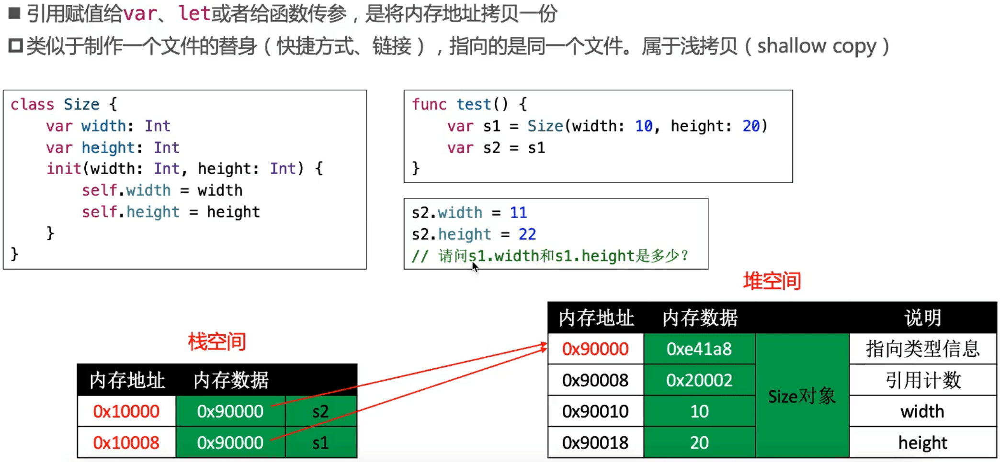

#### 对象的堆空间申请过程

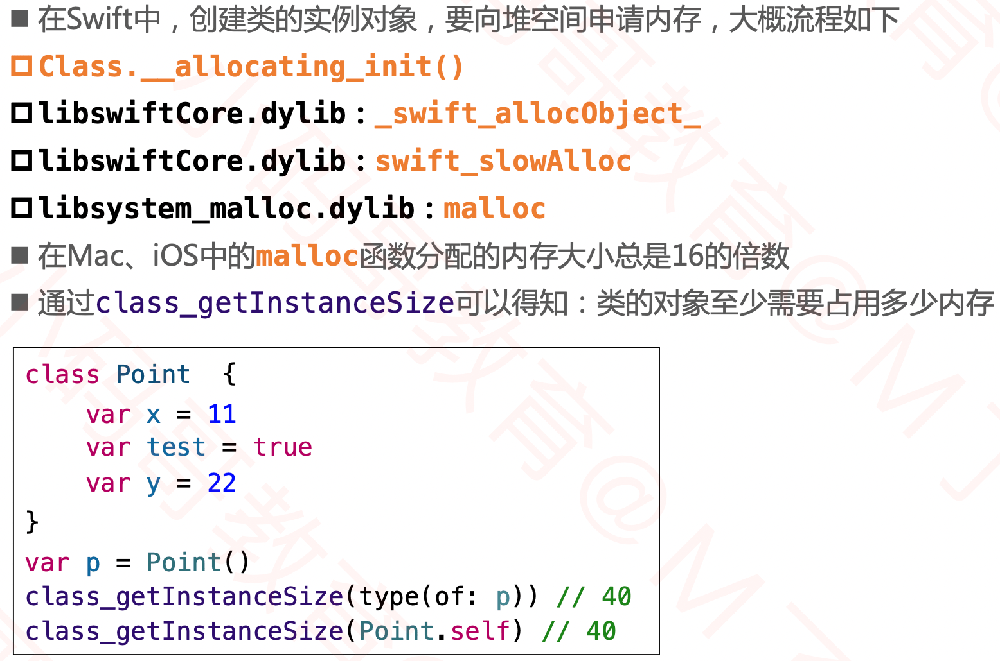

#### 引用类型的赋值操作

### 值类型、引用类型的let

## 嵌套类型

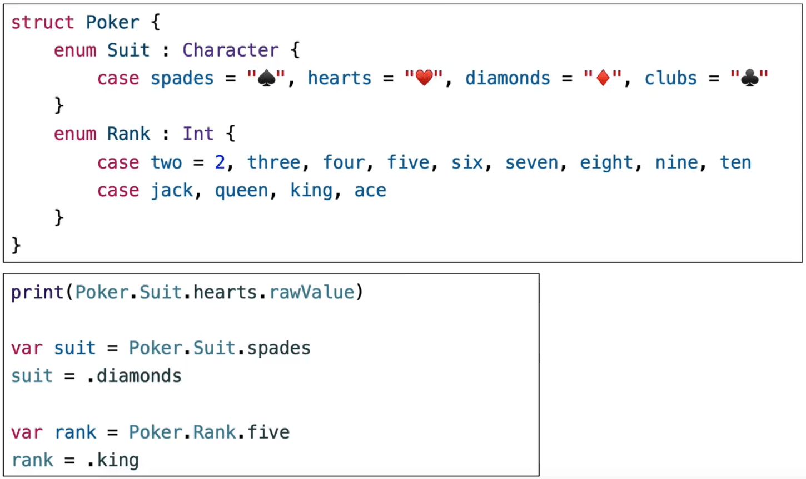

## 枚举、结构体、类都可以定义方法

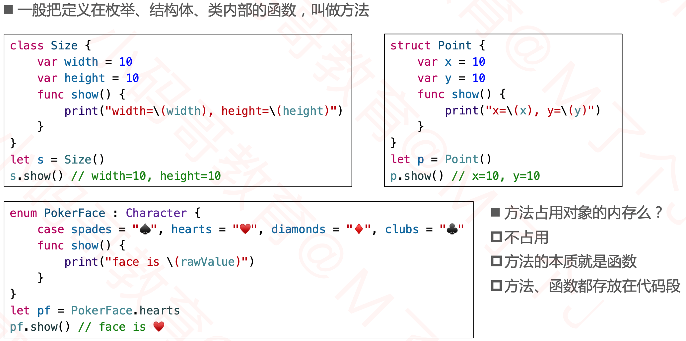

## 作业

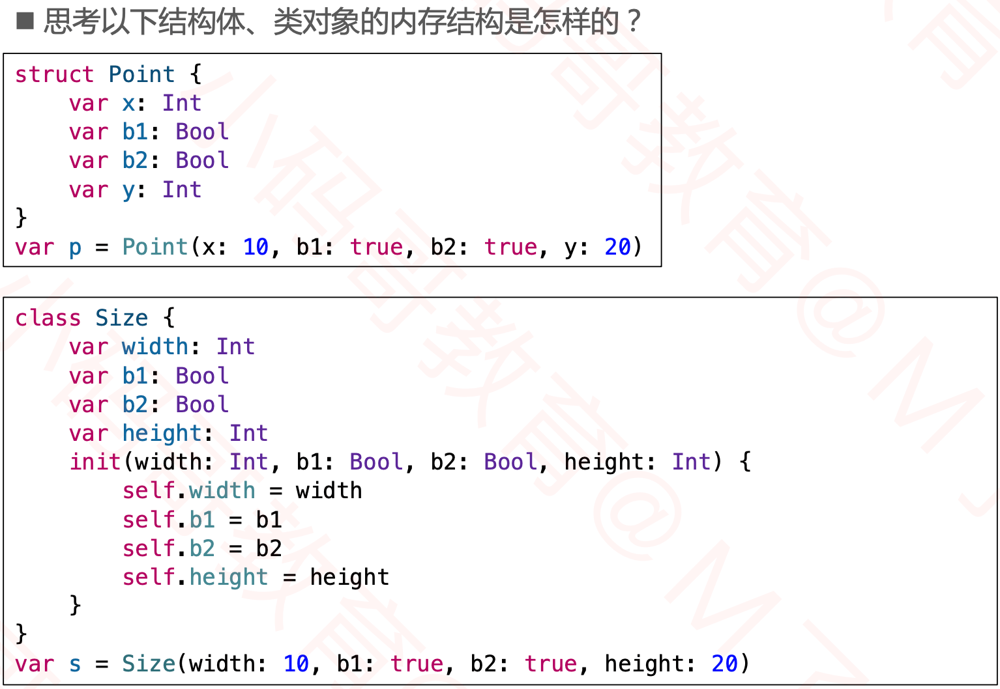