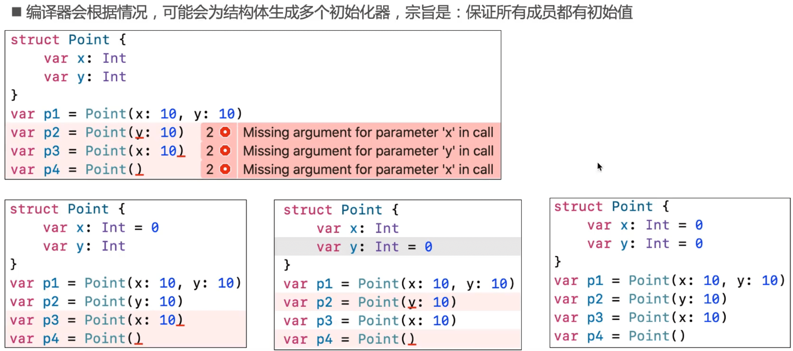
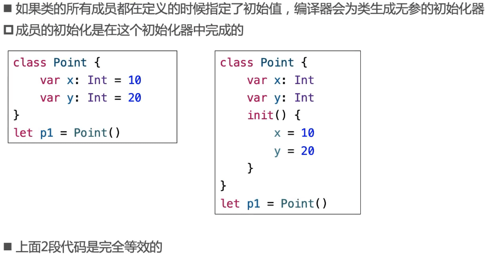
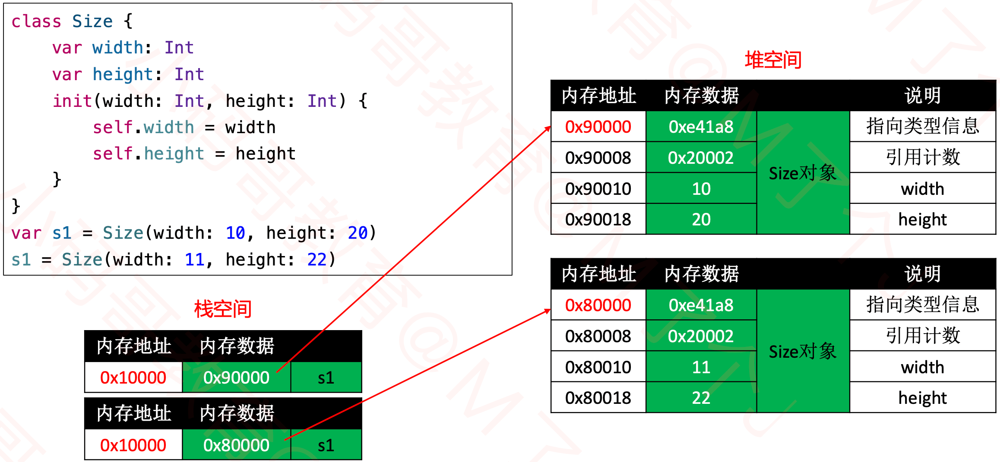
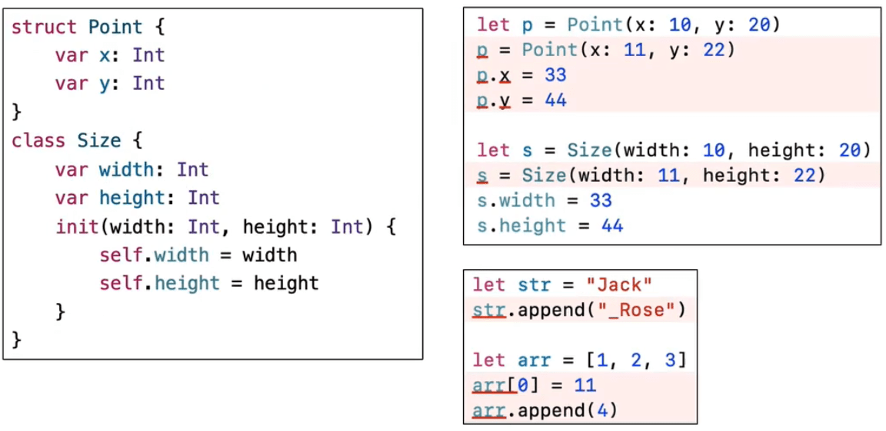

## 结构体

### 结构体的初始化器

### 思考：下面代码能编译通过么？

### 自定义初始化器

### 窥探初始化器的本质

### 结构体内存结构

## 类

### 类的初始化器

### 结构体与类的本质区别

### 对象的堆空间申请过程

### 值类型

#### 值类型的赋值操作

- 在Swift标准库中，为了提升性能, String、Array、 Dictionary、 Set采取了Copy On Write技术
  - 比如仅当有"写” 操作时，才会真正执行拷贝操作
  - 对于标准库值类型的赋值操作，Swift能确保最佳性能，所有没必要为了保证最佳性能来避免赋值
- 建议:不需要修改的,尽量定义成let

- 值类型赋值，内存地址不变，只修内存数据。

### 引用类型

#### 对象的堆空间申请过程

#### 引用类型的赋值操作

### 值类型、引用类型的let

## 嵌套类型

## 枚举、结构体、类都可以定义方法

## 作业

