## 闭包

### 闭包表达式( Closure Expression )

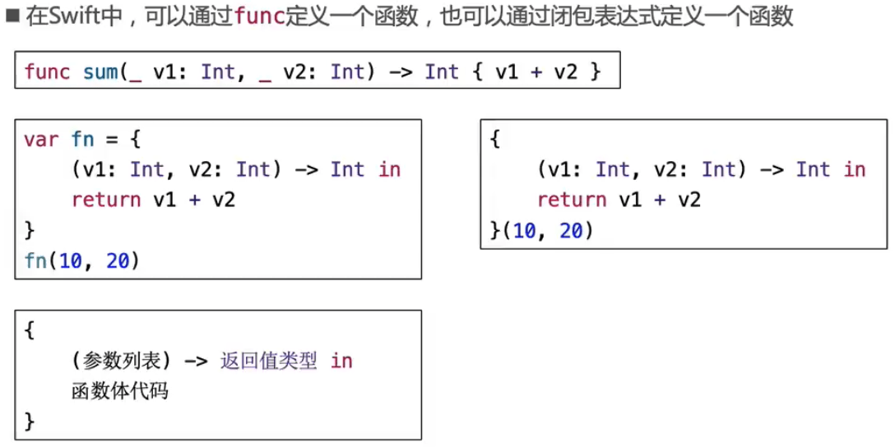

### 闭包表达式的简写

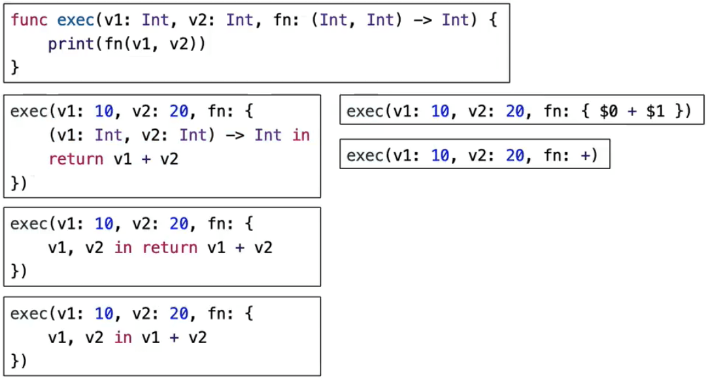

### 尾随闭包

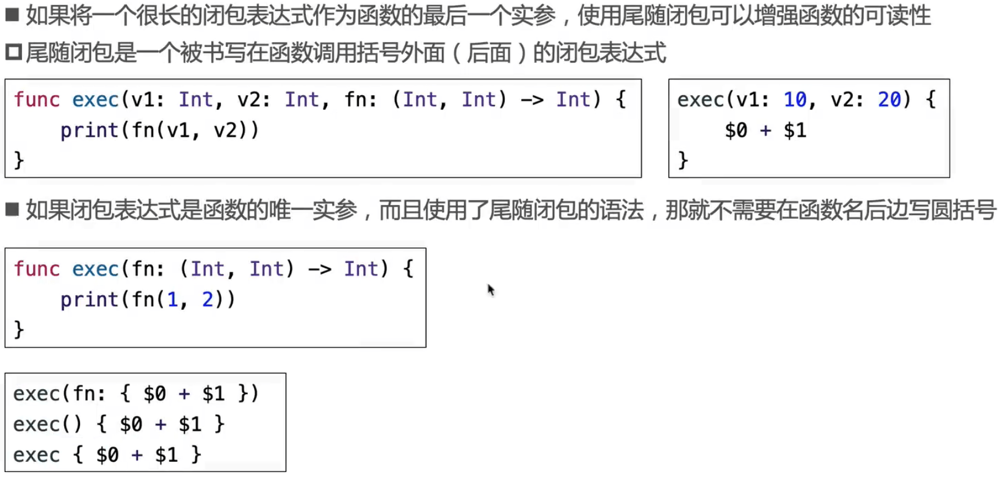

### 示例 - 数组的排序

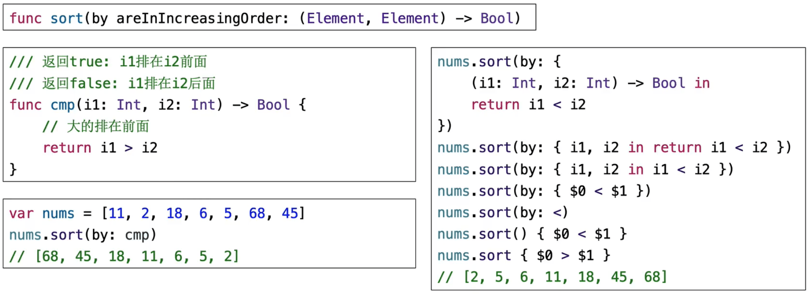

### 忽略参数

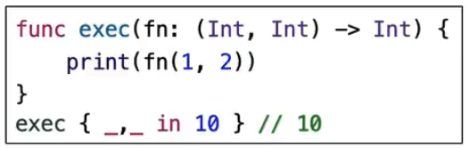

## 闭包（Closure）

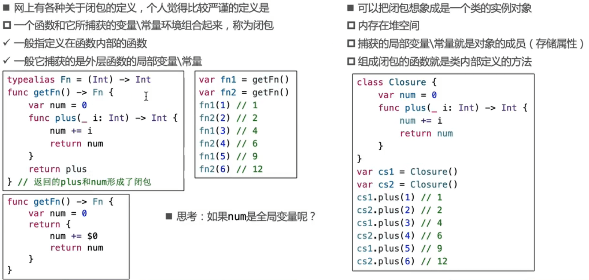

### 练习

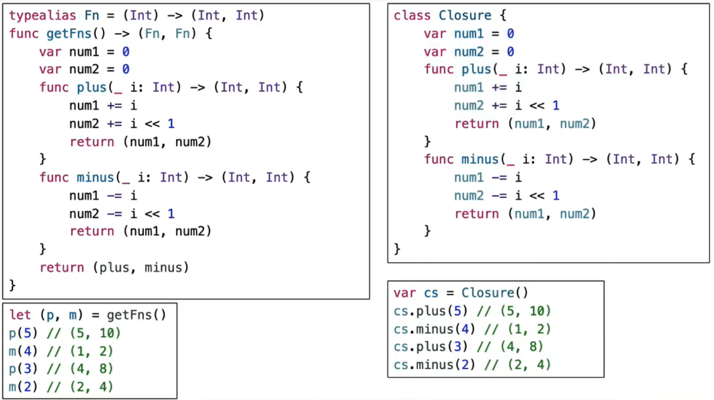

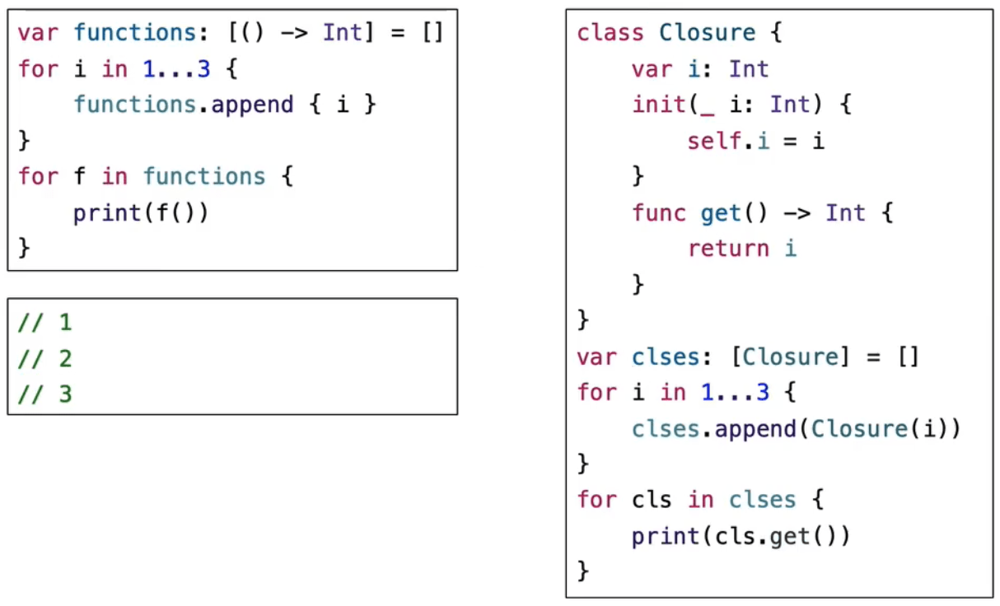

### 注意

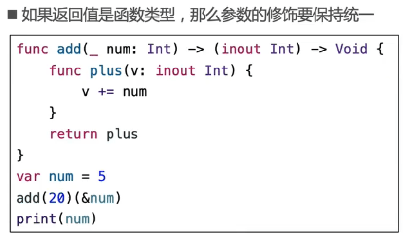

## 自动闭包

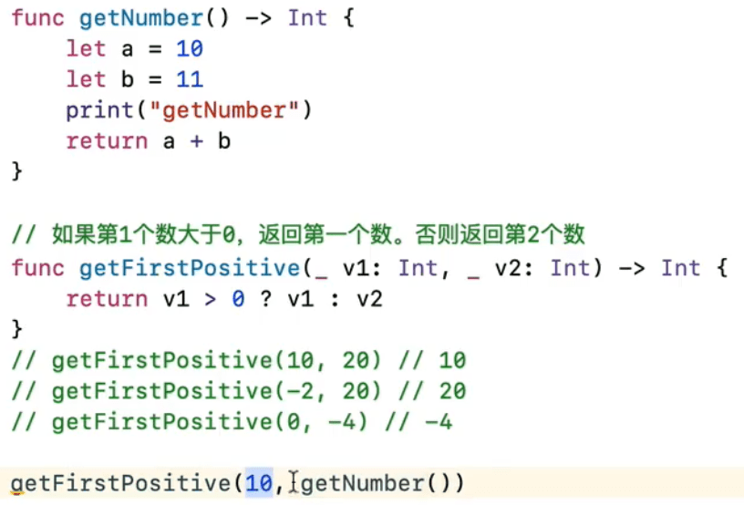

- getNumber这个方法不需要调用，但是还是调用了（会调用print方法），浪费性能。

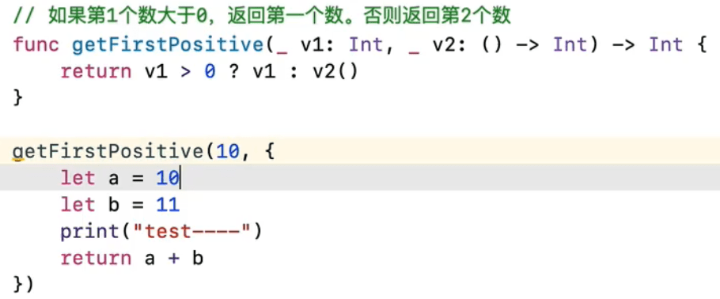

- v2修改成方法不会调用。

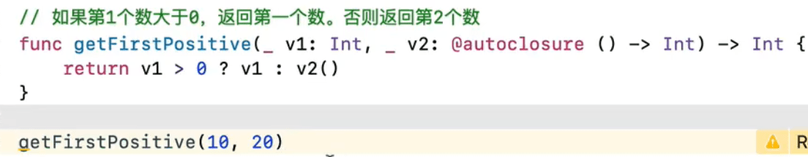

-  改成自闭包效果和getFirstPositive(10,{20})一样，语法糖。

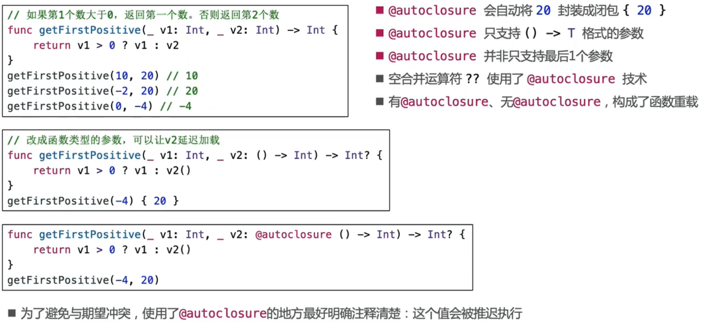

