## 属性

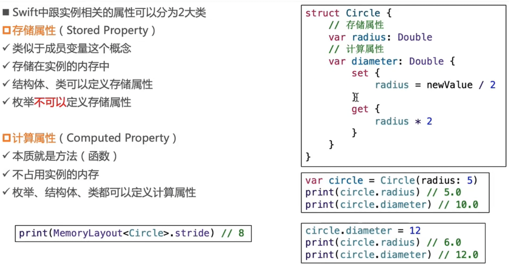

### 存储属性 

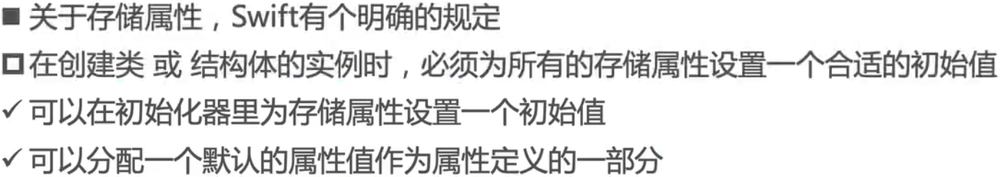

### 计算属性

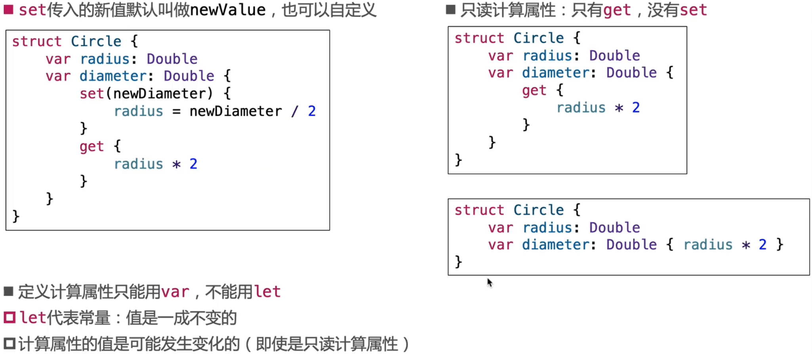

- 计算属性要么只有get，要么get、set同时存在，不能是只有set。

### 枚举rawValue原理

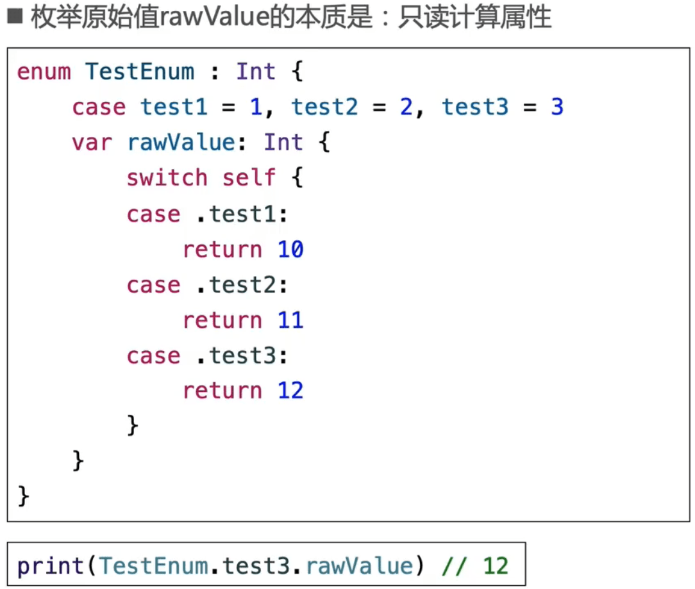

### 延迟存储属性( Lazy Stored Property )

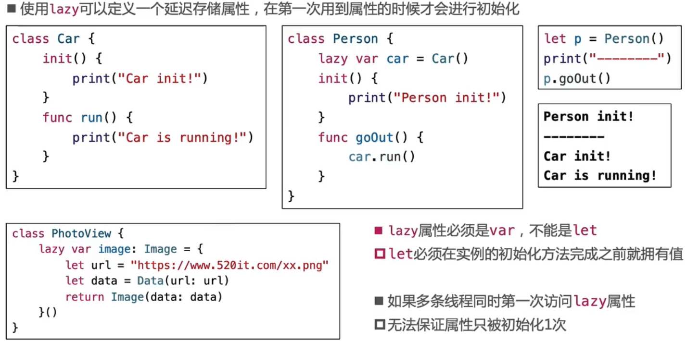

#### 延迟存储属性注意点

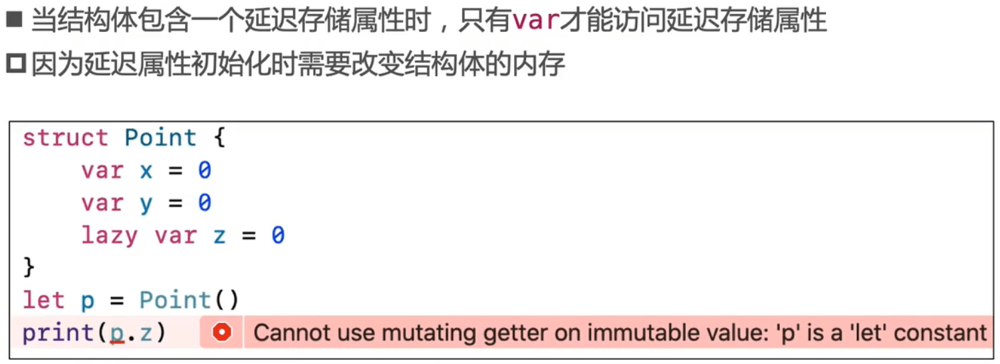

### 属性观察器( Property Observer )

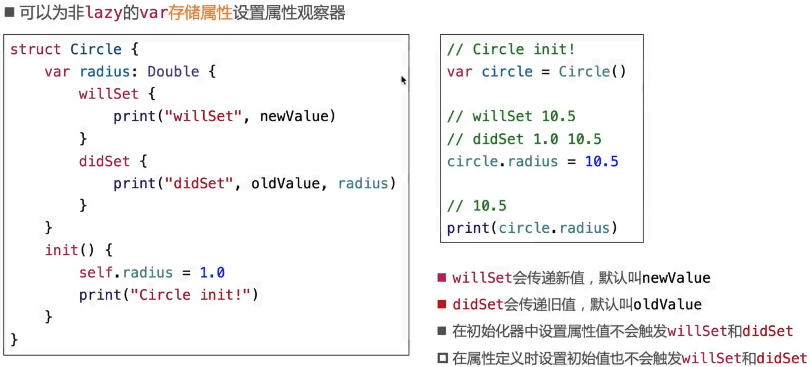

###  全局变量、局部变量

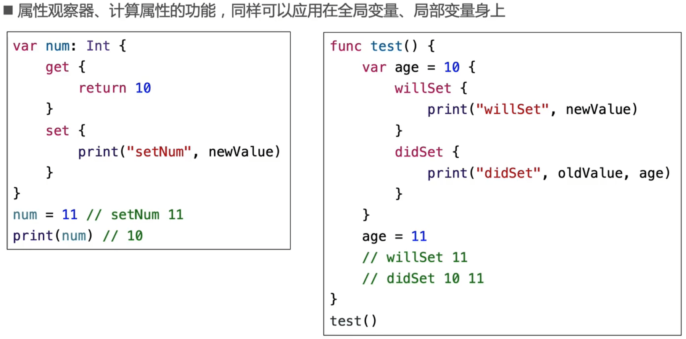

### Intout

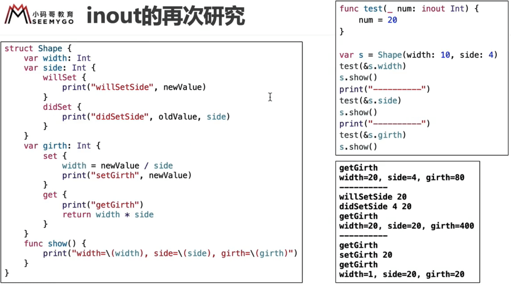

#### intout的本质总结

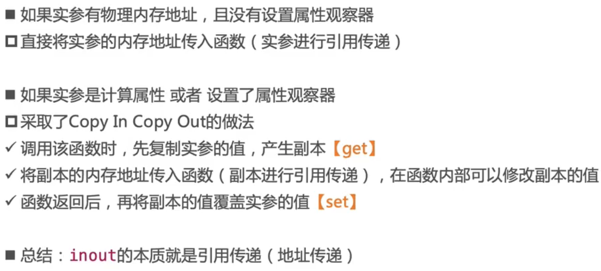

### 类型属性( Type Property )

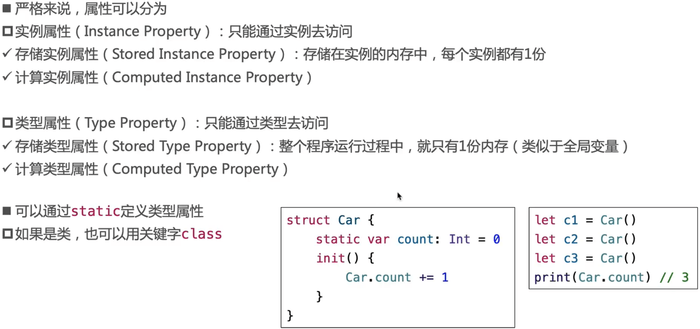

#### 类型属性细节

#### 単例模式

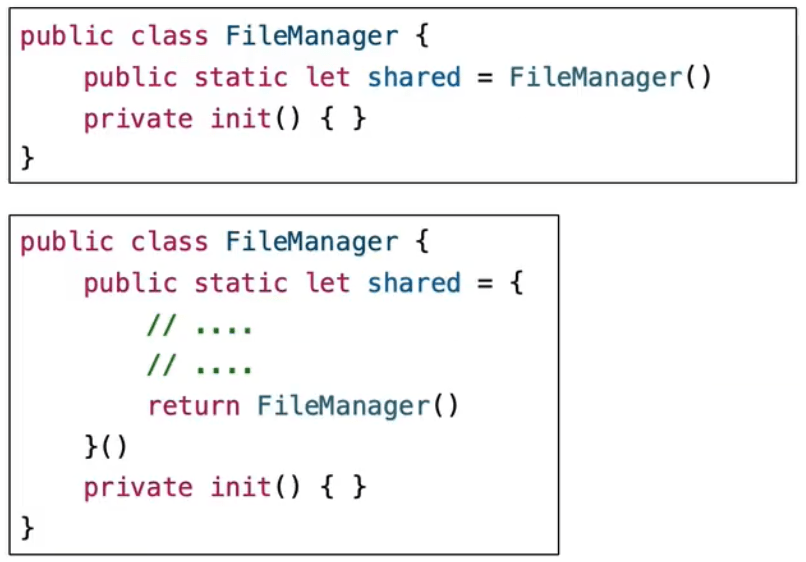