## 方法

### 方法（method）

### mutating

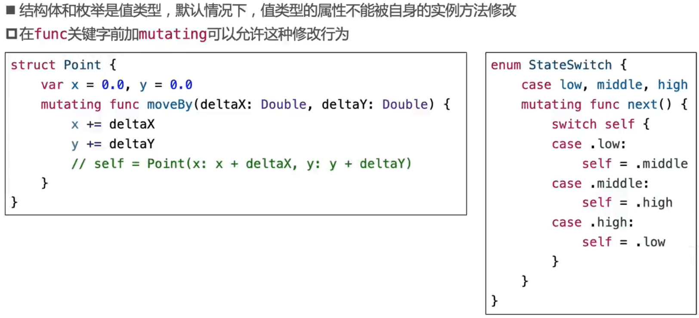

### @discardableResult

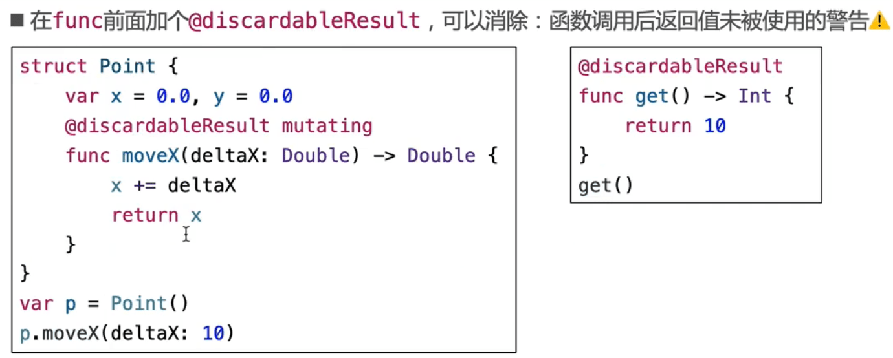

## 下标

### 下标( subscript )

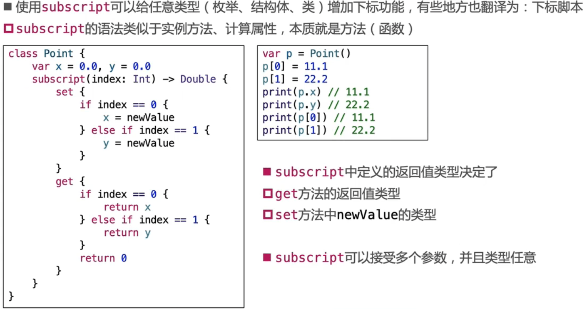

### 下标的细节

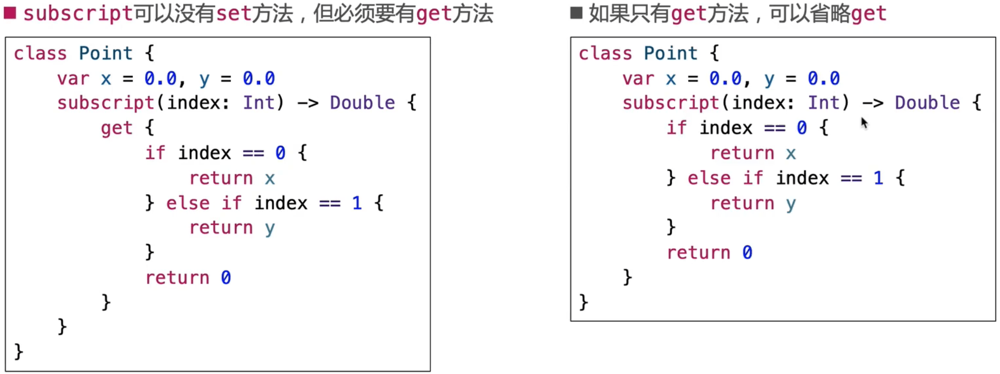

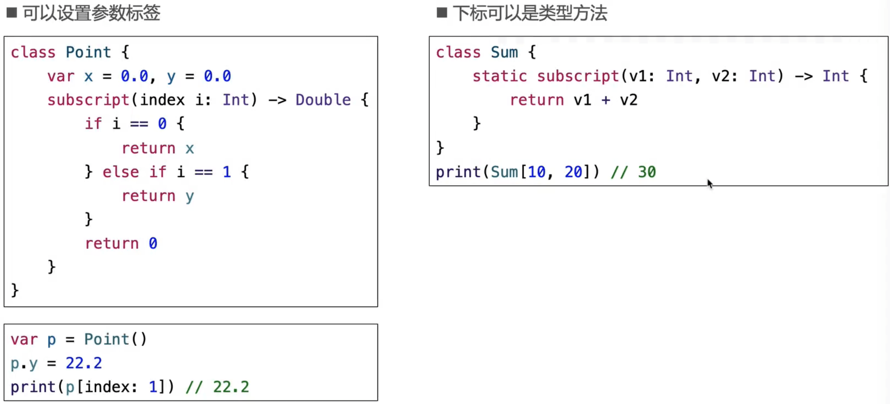

#### 结构体、类作为返回值对比

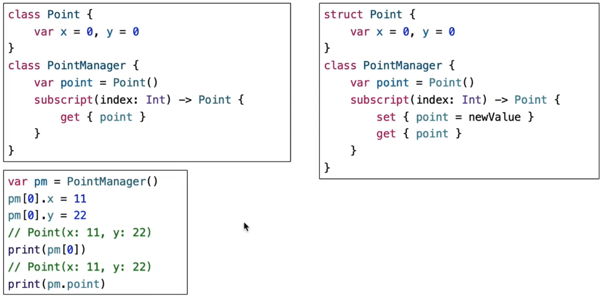

- class类型subscript方法中可以不写set，如果写了，相当于重新生成了一个point对象赋值，而不是修改之前的point属性。struct赋值是修改原来的，可以观察内存变化。

#### 接收多个参数的下标

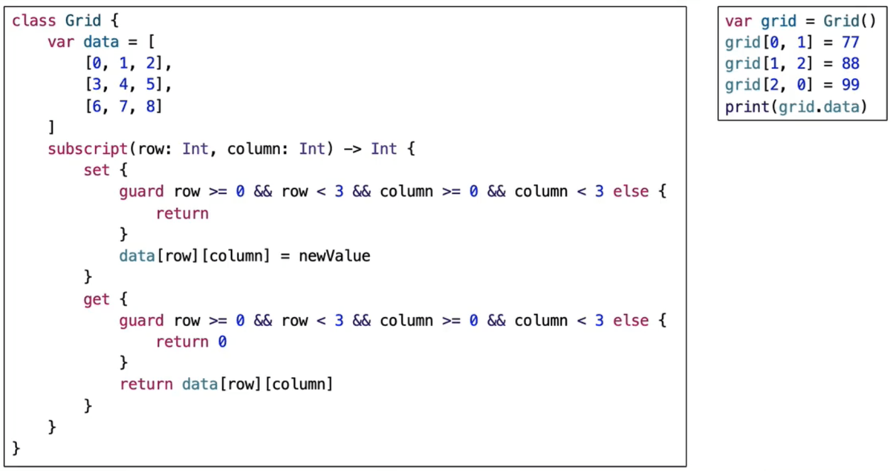

## 继承

### 继承 ( Inheritance )

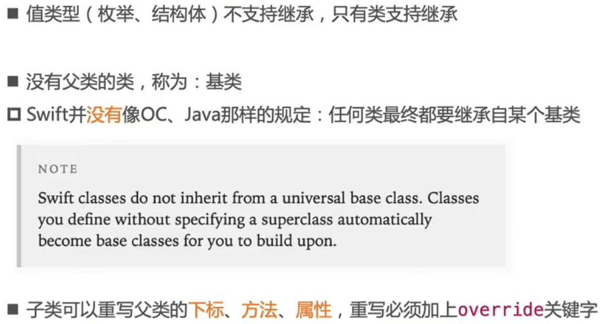

#### 内存结构

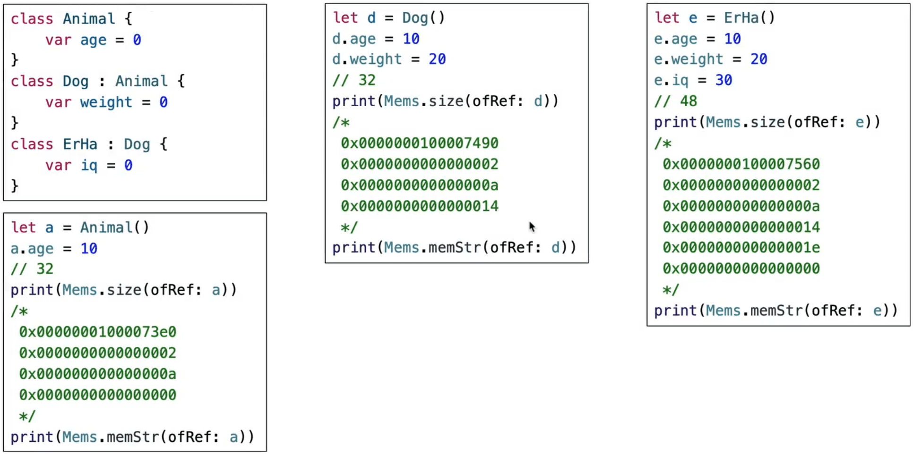

### 重写

#### 重写实例方法、下标

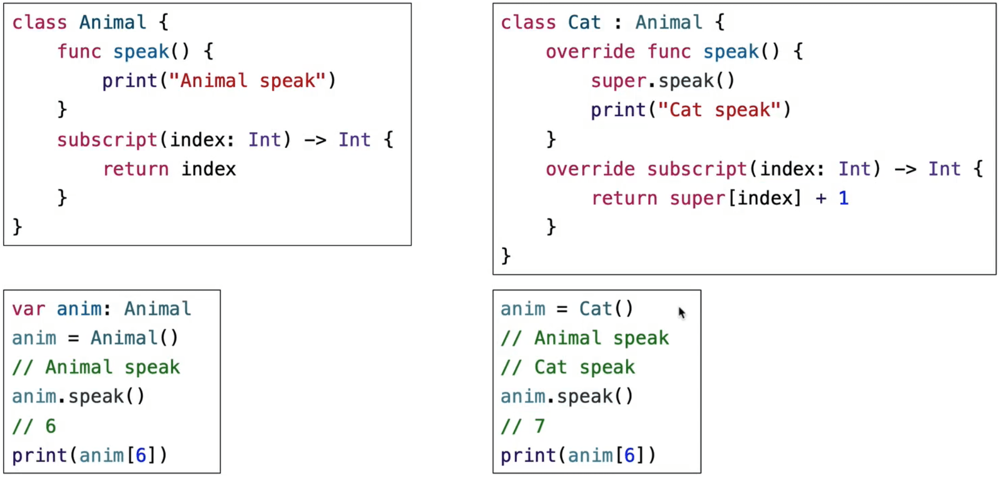

#### 重写类型方法、下标

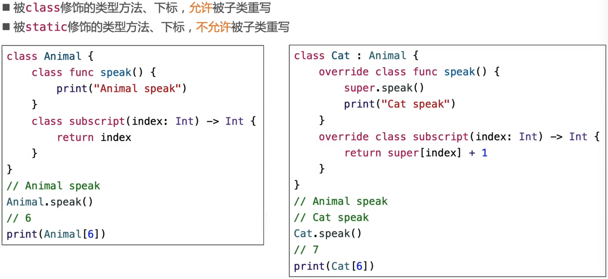

#### 重写属性

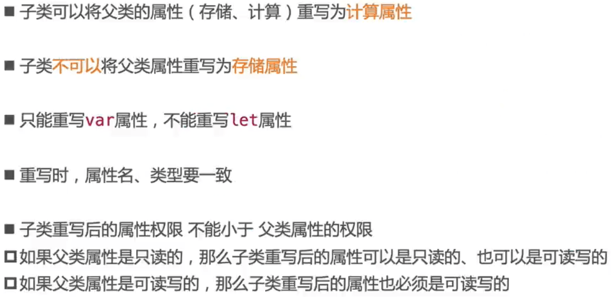

#### 重写实例属性

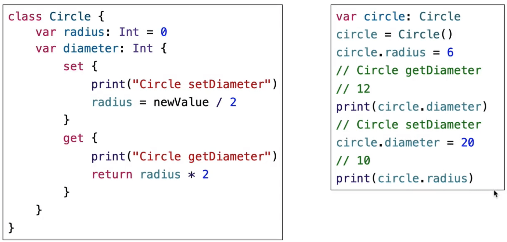

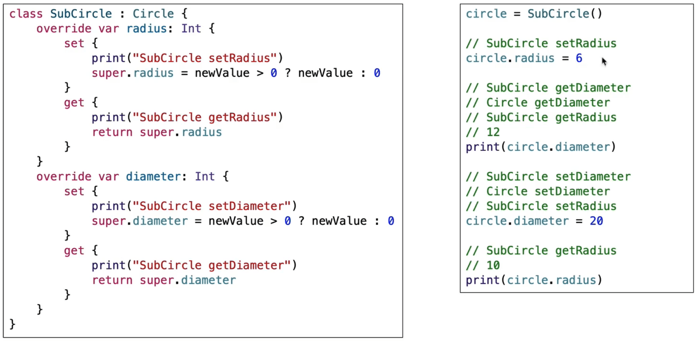

#### 重写类型属性

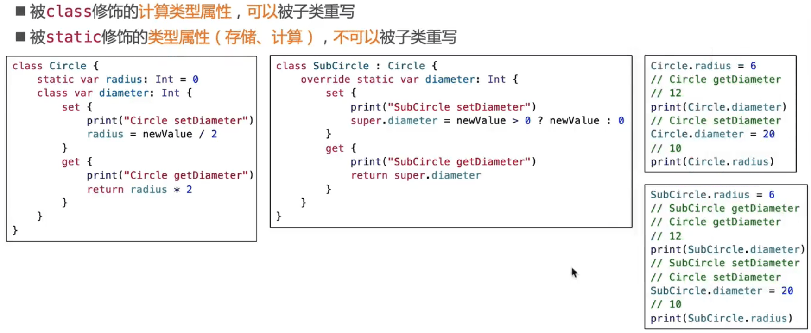

### 属性观测器

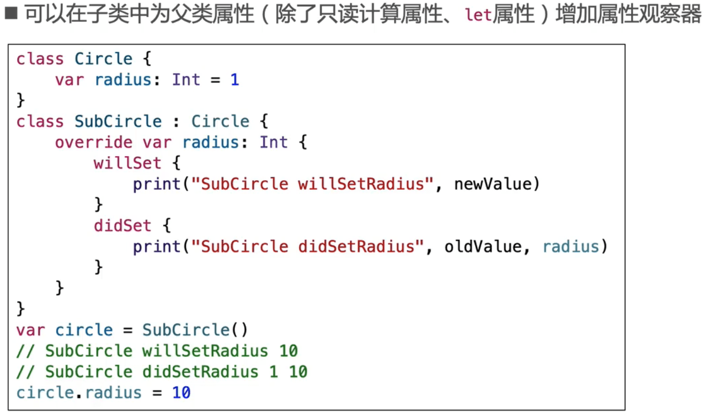

- 设置之前需要先拿到之前的值赋值给oldvalue，newvalue

### final

- 被final修饰的方法、下标、 属性，禁止被重写
- 被final修饰的类,禁止被继承