## 越狱环境搭建

### 学习条件

### **iOS** Jailbreak

- 什么是iOS Jailbreak？
  - 利用iOS系统的漏洞，获取iOS系统的最高权限（Root），解开之前的各种限制（合法行为）

#### 优点

#### 缺点

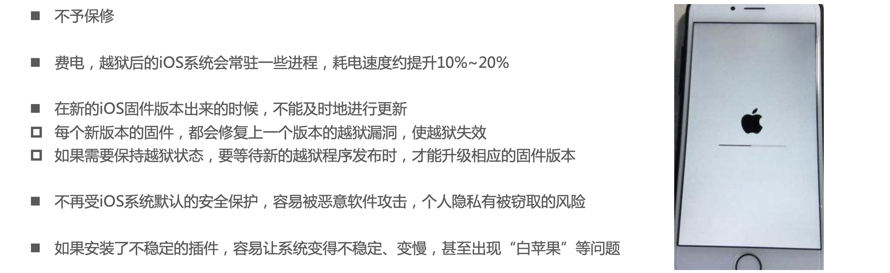

### 完美越狱和不完美越狱

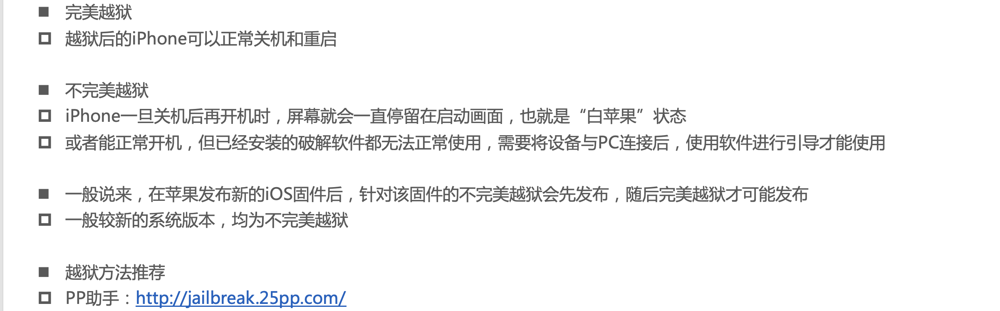

- http://jailbreak.25pp.com/

### 如何判断是否越狱成功？

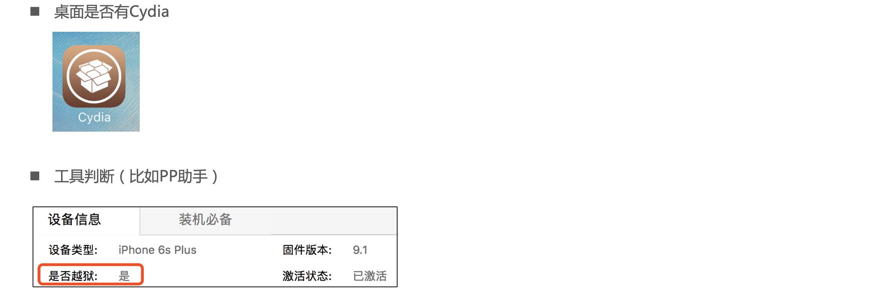

## Cydia

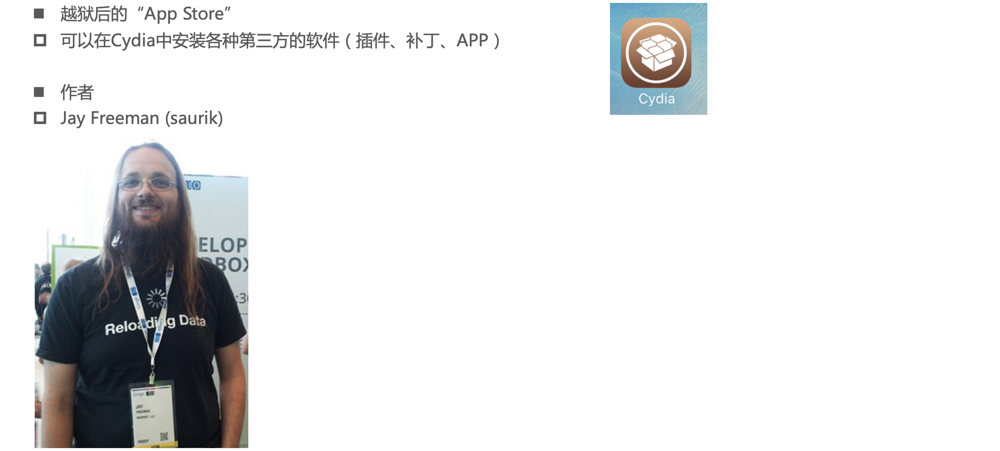

### Cydia安装软件的步骤1

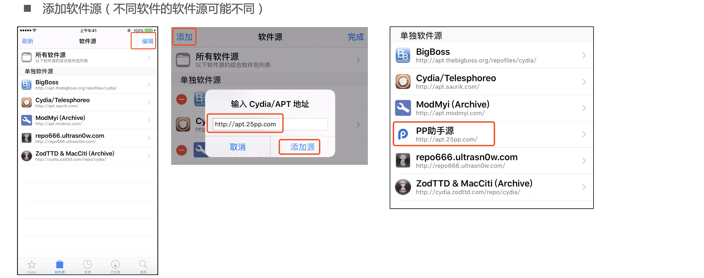

### Cydia安装软件的步骤2

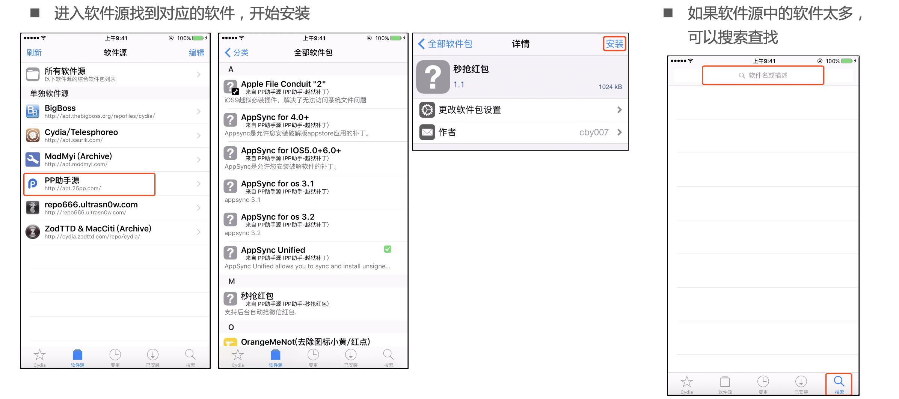

## SpringBoard

## Apple File Conduit "2"

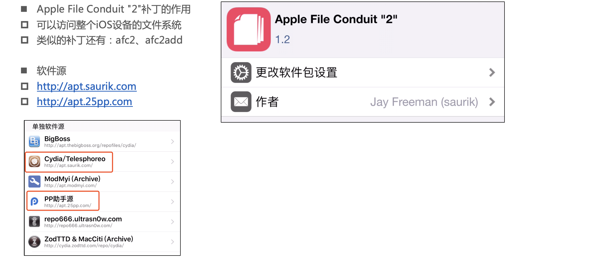

## AppSync Unified

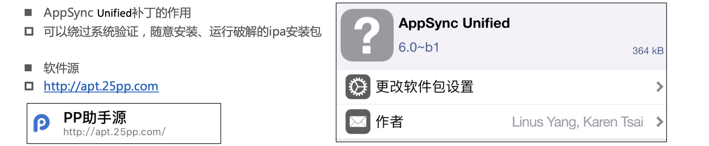

## iFile

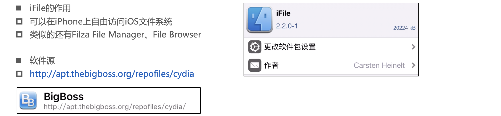

## PP助手

## Mac必备

## 安装总结

### 建议的安装顺序

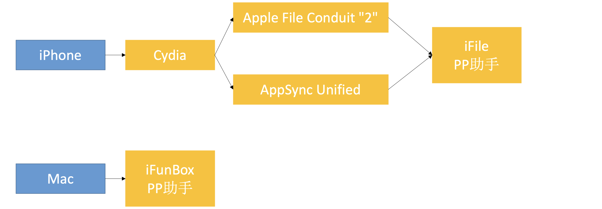

### 安装包

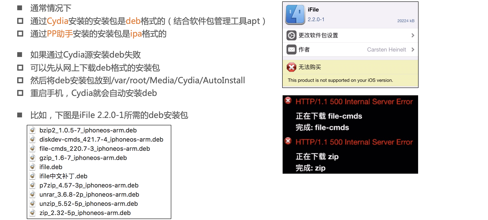

## 如何在iOS代码中判断设备是否越狱？

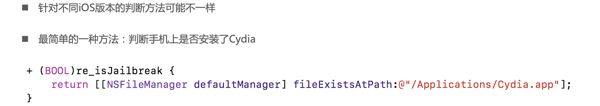