## 逆向环境搭建

### 提供工作效率的工具

### SSH登录

#### Mac远程登录到iPhone

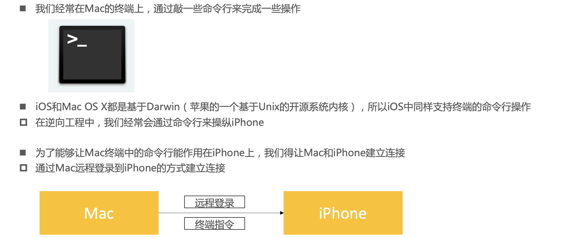

#### SSH、OpenSSH

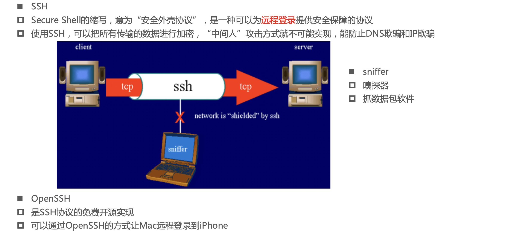

#### 使用OpenSSH远程登录

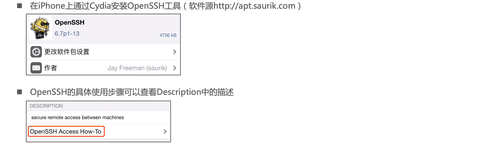

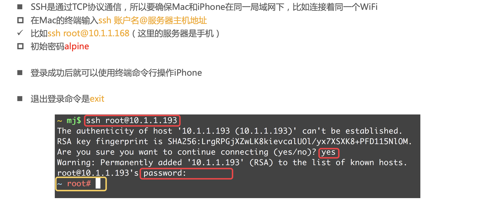

#### root、mobile

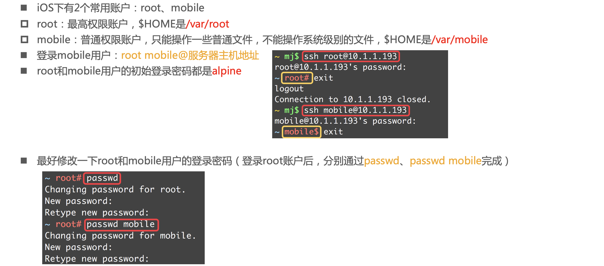

### SSL、OpenSSL

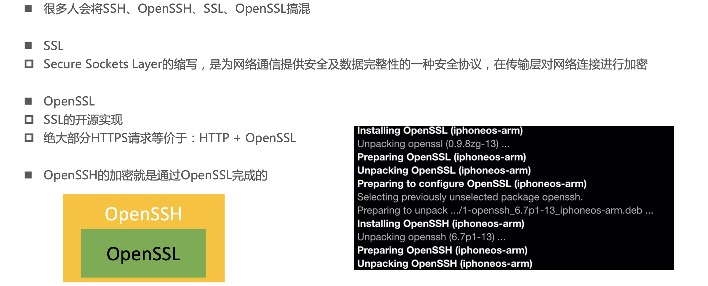

### SSH的版本

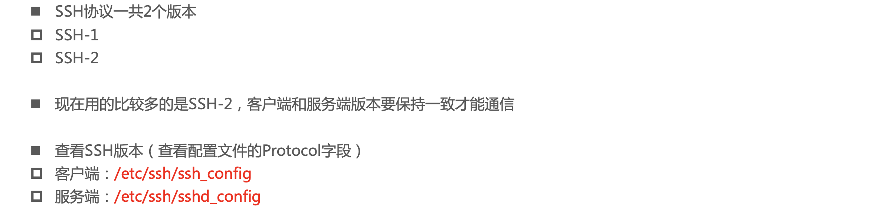

### SSH的通信过程

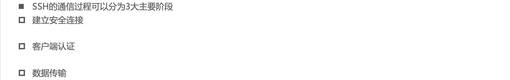

#### 建立安全连接

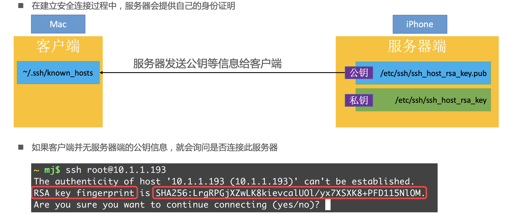

##### 服务器身份信息变更

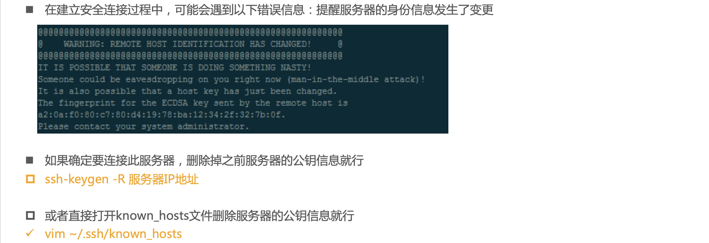

#### 客户端认证

##### SSH的客户端认证方式

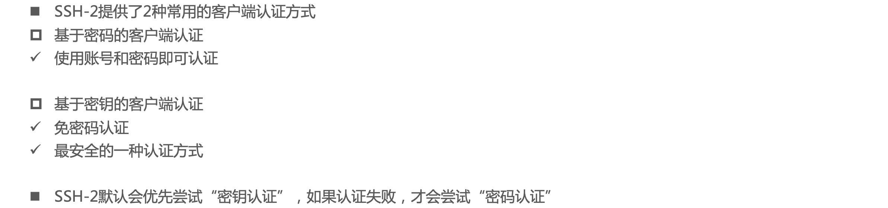

##### SSH - 基于密钥的客户端认证

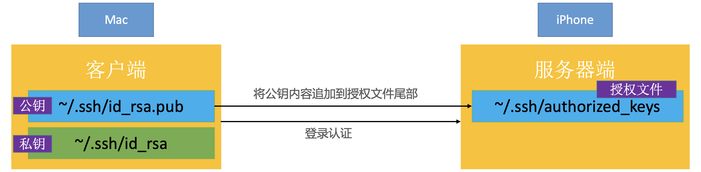

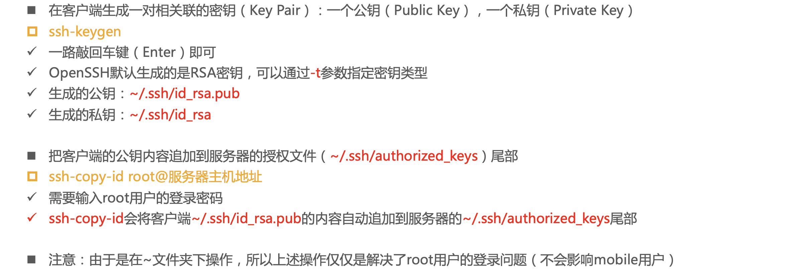

##### 公钥 >> 授权文件

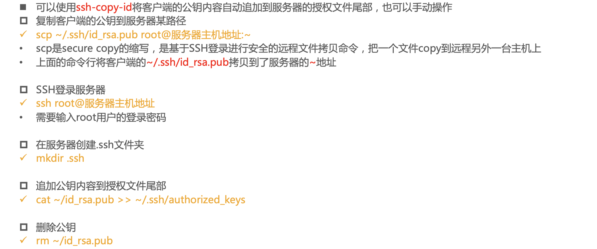

##### 文件权限问题

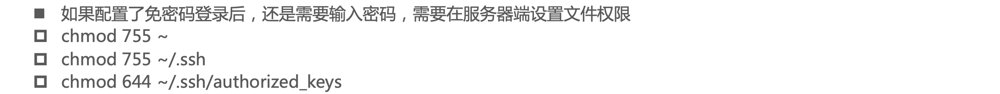

### USB-SSH登陆

#### 22端口

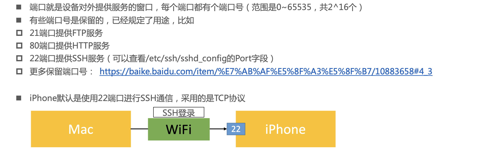

- [https://baike.baidu.com/item/%E7%AB%AF%E5%8F%A3%E5%8F%B7/10883658#4_3](https://baike.baidu.com/item/端口号/10883658)

#### 通过USB进行SSH登录

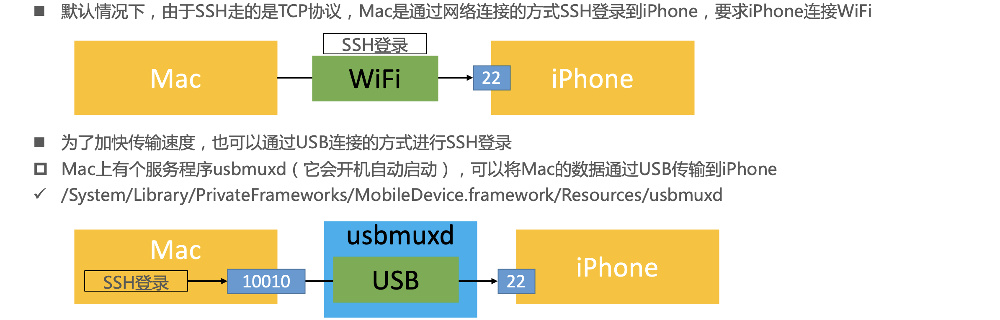

#### usbmuxd的使用

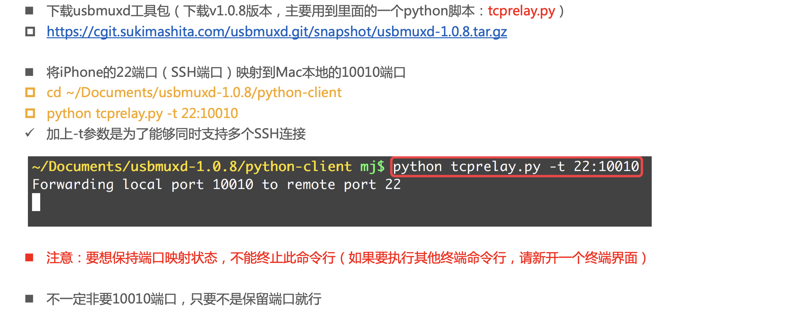

- https://cgit.sukimashita.com/usbmuxd.git/snapshot/usbmuxd-1.0.8.tar.gz

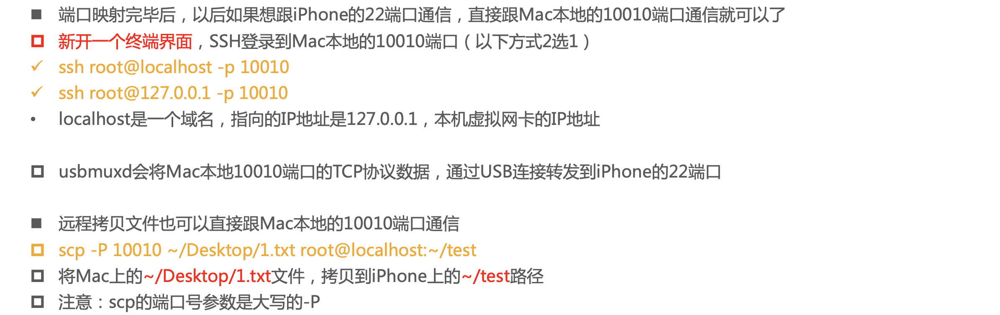

#### sh脚本文件

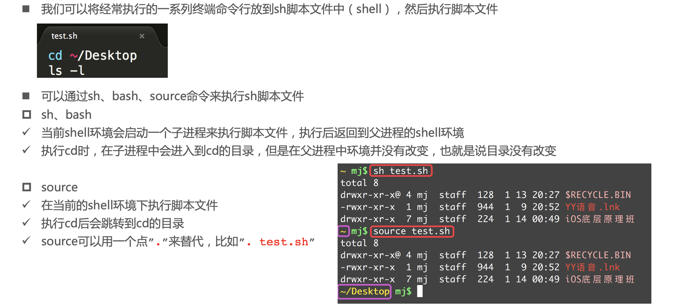

#### iOS终端的中文乱码问题

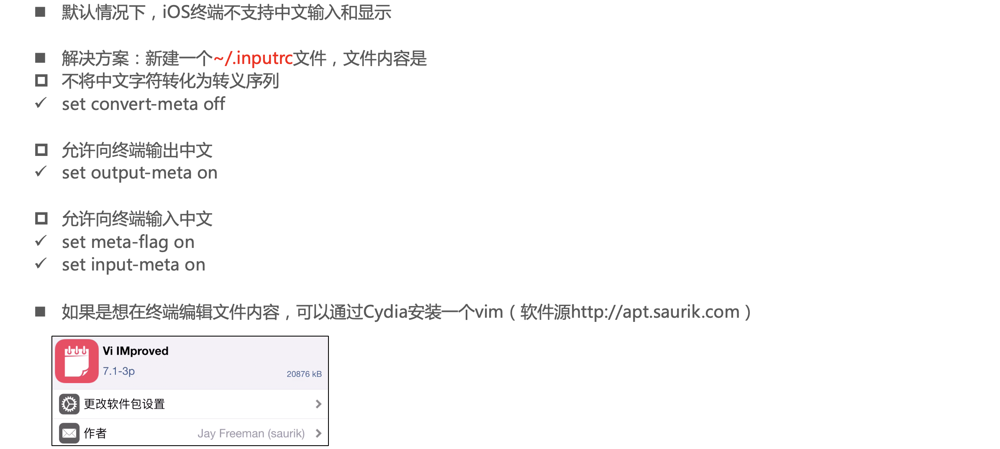