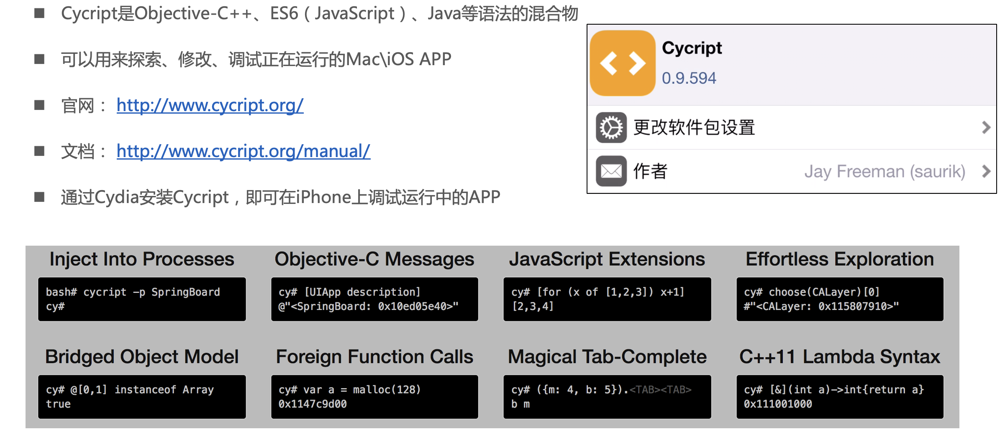
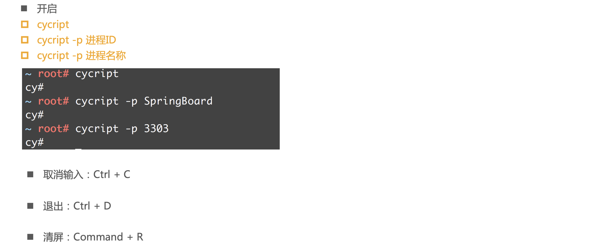
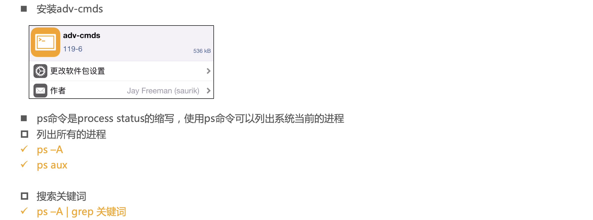
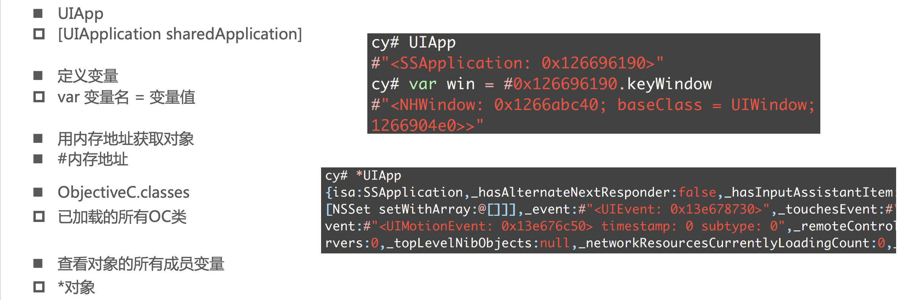
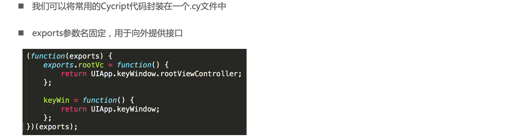
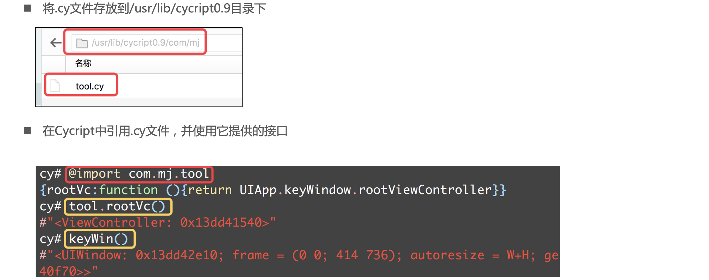
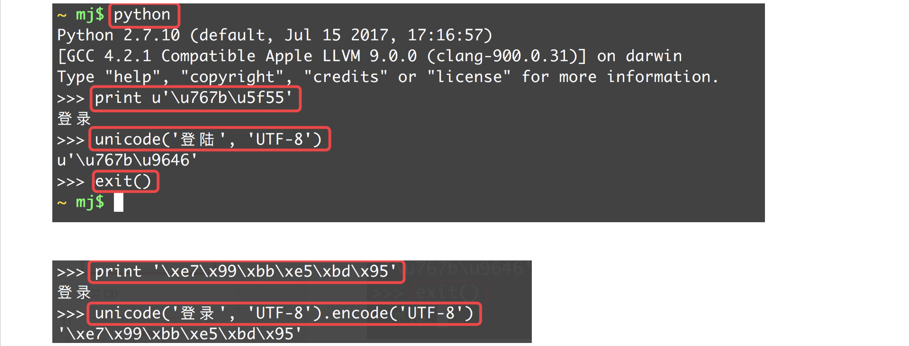
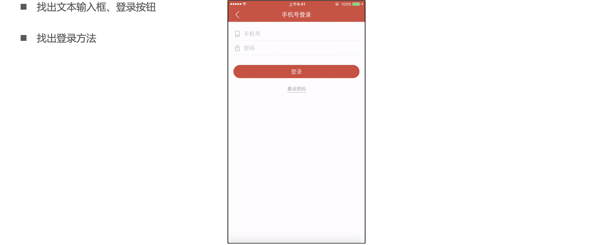

## Cycript

- http://www.cycript.org/

- http://www.cycript.org/manual/

### Cycript的开启和关闭

### ps命令

### 常用语法

## 封装Cycript

### .cy文件编写

### 存放和使用.cy文件

### Cycript库

- https://github.com/CoderMJLee/mjcript

## 利用python打印字符

## 练习

### 网易云音乐

### 喜马拉雅FM

### 微信

