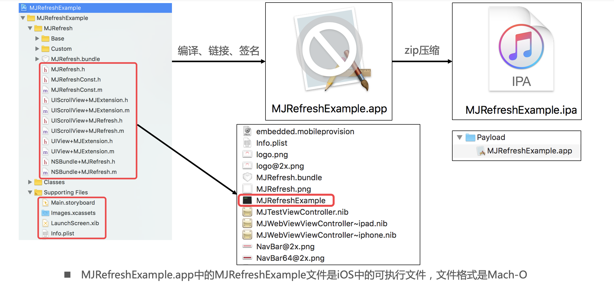
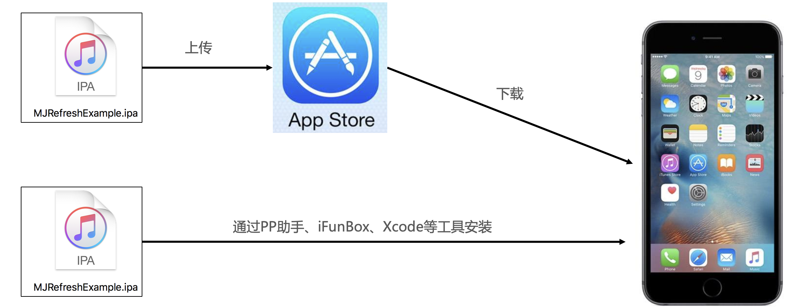
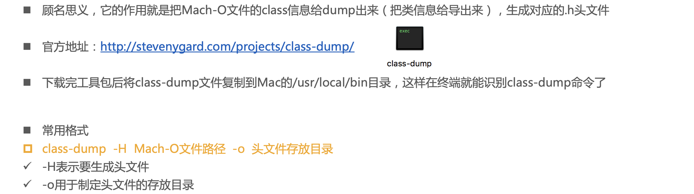
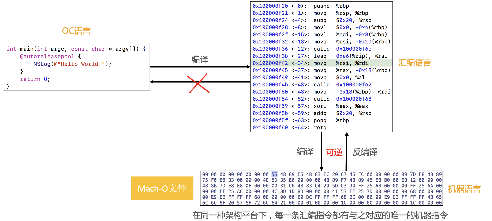
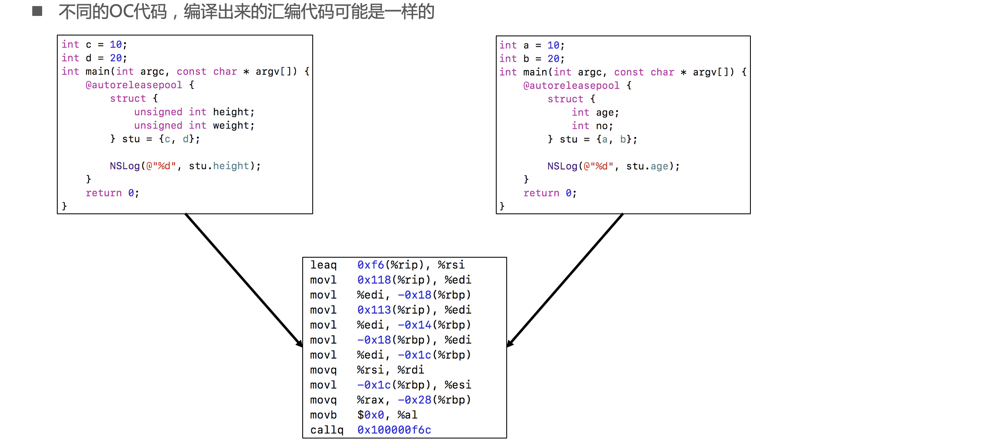
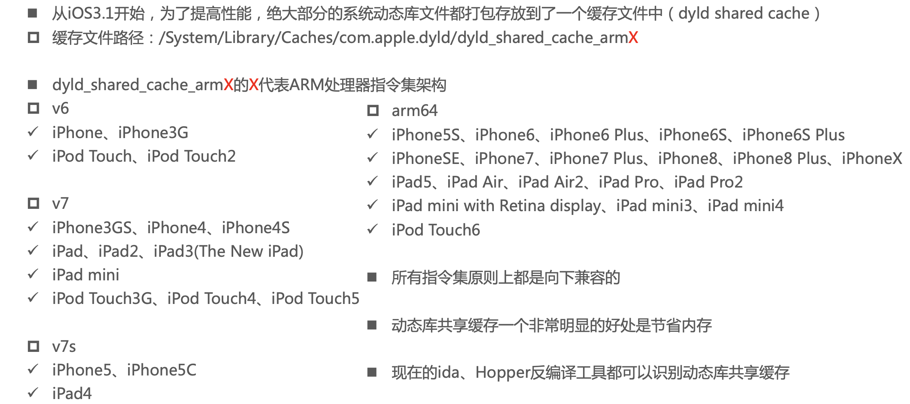
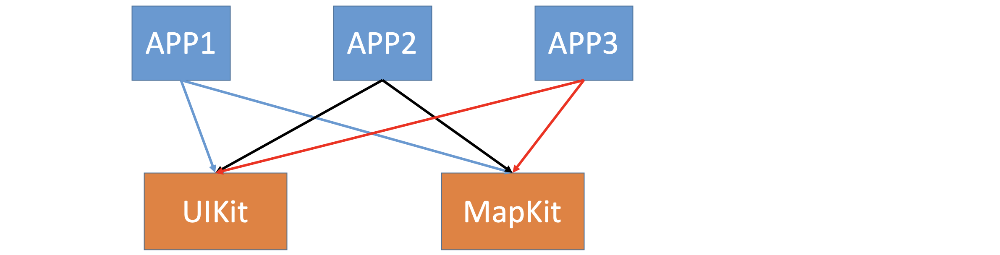
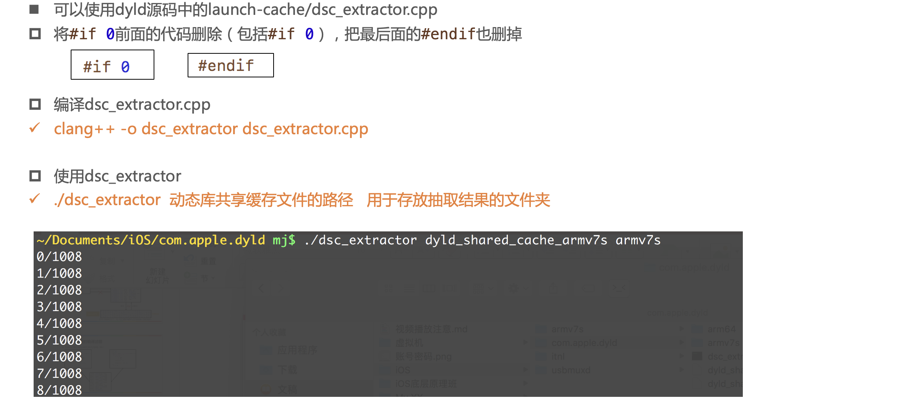
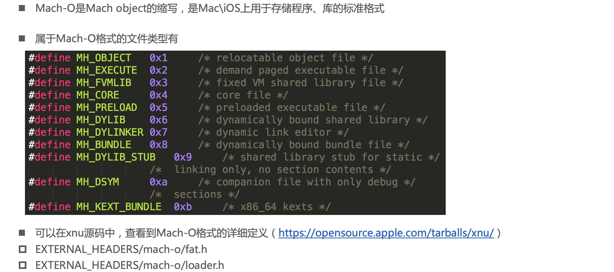
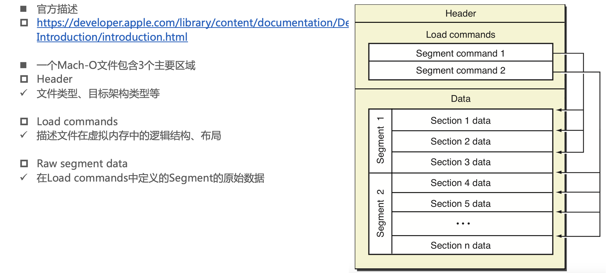

## APP的生命周期

### APP从开发到安装到手机的过程

## 逆向APP的思路

## class-dump

- http://stevenygard.com/projects/class-dump/

## Hopper

### 代码的编译过程

### Hopper Disassmbler

## 系统的动态库

### 动态库共享缓存（dyld shared cache）

### 动态库的加载

- https://opensource.apple.com/tarballs/dyld/

### 从动态库共享缓存抽取动态库

## Mach-O

- https://opensource.apple.com/tarballs/xnu/

### 常见的Mach-O文件类型

### 在Xcode中查看target的Mach-O类型

### Mach-O的基本结构

- https://developer.apple.com/library/content/documentation/DeveloperTools/Conceptual/MachOTopics/0-Introduction/introduction.html

### 窥探Mach-O的结构

- https://github.com/gdbinit/MachOView

### Universal Binary（通用二进制文件）

### dyld和Mach-O

