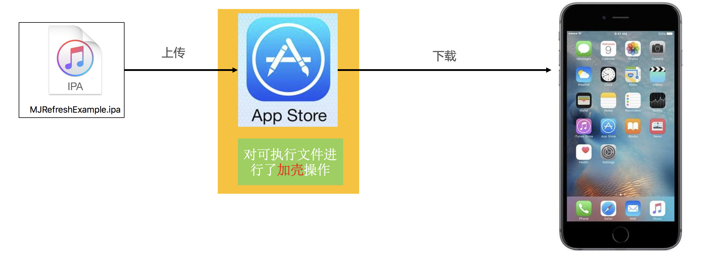
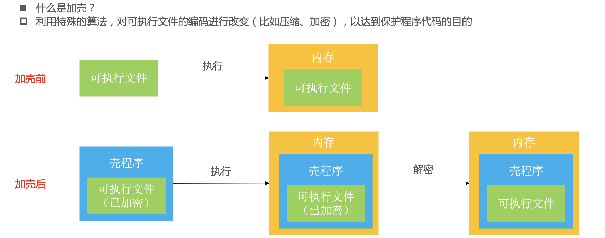
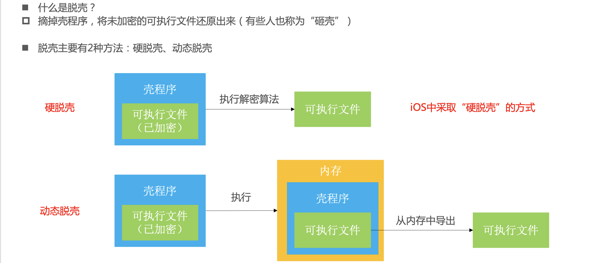
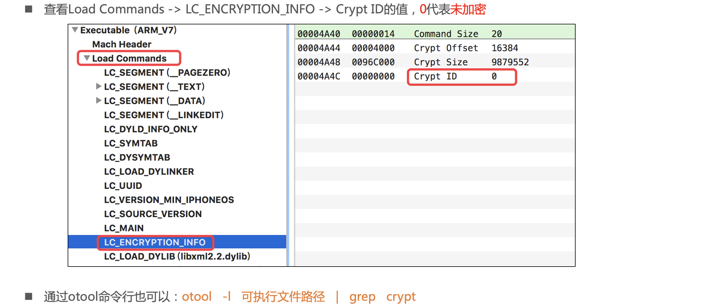
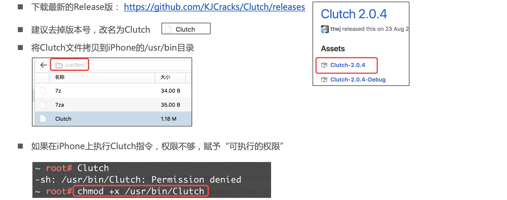
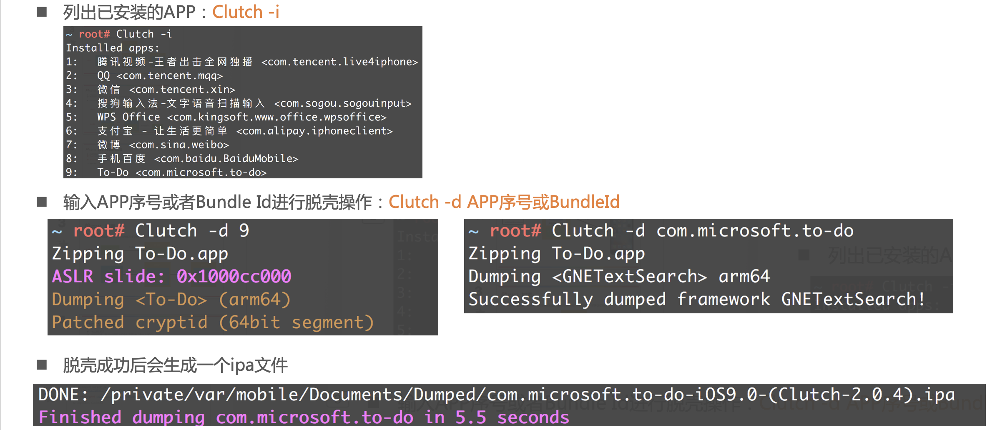
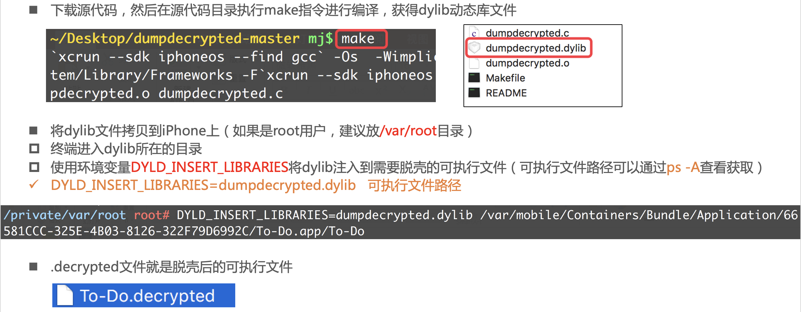
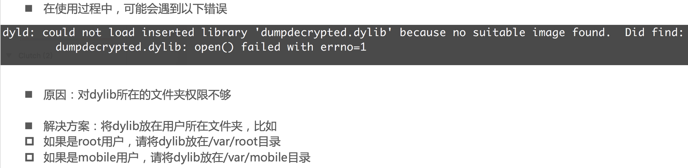

## 壳

### 加壳

### 脱壳

### iOS中的脱壳工具

- https://github.com/KJCracks/Clutch

- https://github.com/stefanesser/dumpdecrypted/

### 如何验证可执行文件是否已经脱壳？

## Clutch

### 配置

- https://github.com/KJCracks/Clutch/releases

### 使用

## dumpdecrypted

