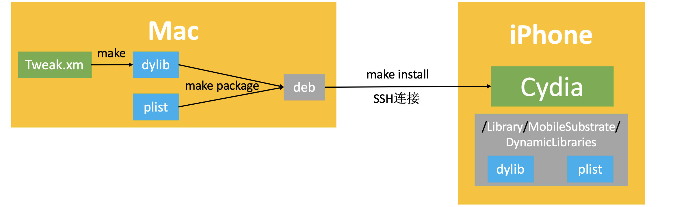
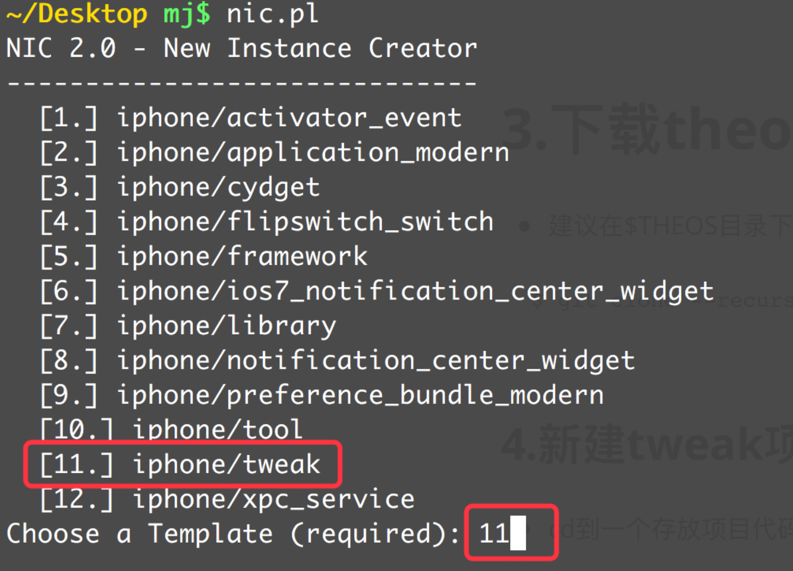
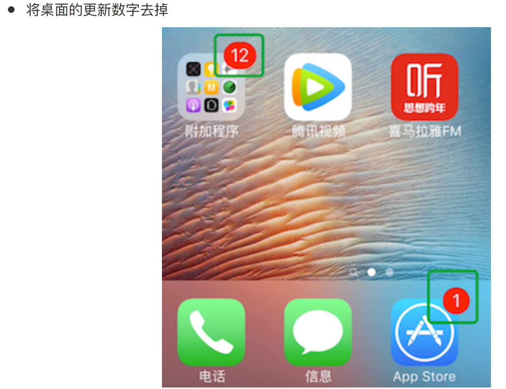
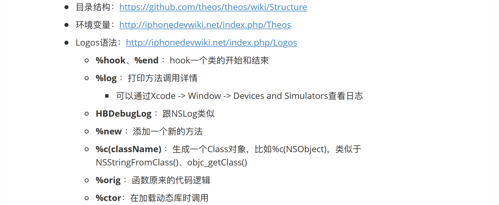
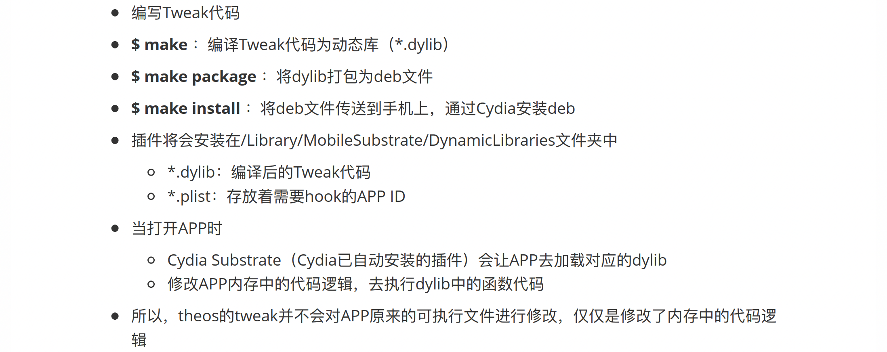
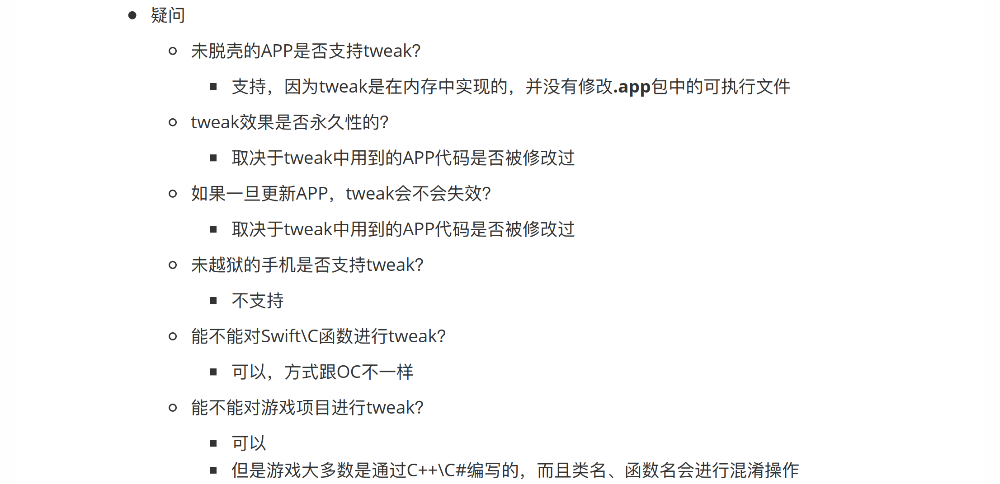
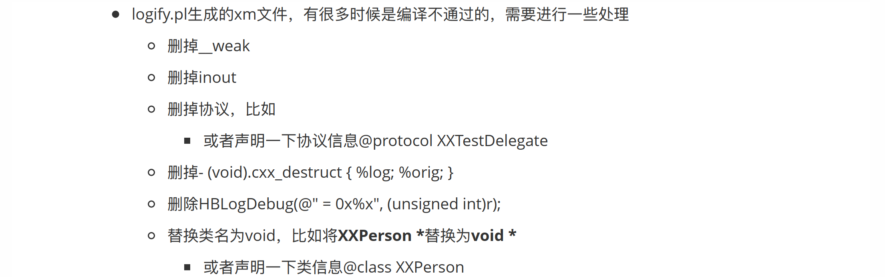

## tweak

### tweak的开发过程



### tweak的运行过程


## theos

### 一、安装签名工具ldid

- 先确保安装了[brew](https://brew.sh)

```
$ /usr/bin/ruby -e "$(curl -fsSL
https://raw.githubusercontent.com/Homebrew/install/master/install)"
```

- 利用brew安装ldid

```
$ brew install ldid
```

### 二、修改环境变量

- 编辑用户的配置文件

```
$ vim ~/.bash_profile
```

- 在.bash_profie文件后面加入以下2行

```
export THEOS=~/theos
export PATH= $THEOS/bin:$PATH
```

- 让.bash_profiel配 置的环境变量立即生效(或者重新打开终端)

```
$ source ~/.bash_profile
```

### 三、下载theos 

- 建议在$THEOS目录下载代码(也就是刚才配置的~/theos目录)

```
$ git clone --recursive https://github.com/theos/theos.git $THEOS
```

### 四、新建tweak项目

- cd到一个存放项目代码的文件夹(比如桌面)

```
$ cd ~/Desktop
$ nic.pl
```

- 选择[11.] iphone/tweak



- 填写项目信息
  - Project Name
    - 项目名称
  - Package Name
    - 项目ID (随便写)
  - Author/Maintainer Name
    - 作者
    - 直接敲回车按照默认做法就行(默认是Mac上的用户名)
  - [iphone/tweak] MobileSubstrate Bundle filter
    - 需要修改的APP的Bundle ldentifier (喜马拉雅FM的是com.gemd.iting)
    - 可以通辻Cycript査看APP的Bundle ldentifier
  - [iphone/tweak] List of applications to terminate upon installation
    - 直接敲回车按照默认做法就行

```
Project Name (required): ting_tweak
Package Name [com.yourcompany.ting_tweak]: com.mj.ting
Author/Maintainer Name [MJ Lee]:
[iphone/tweak] MobileSubstrate Bundle filter [com.apple.springboard]:
com.gemd.iting
[iphone/tweak] List of applications to terminate upon installation (spaceseparated, '-' for none) [SpringBoard]:
Instantiating iphone/tweak in ting_tweak/...
Done.
```

五、编辑Makefile

- 在前面加入环境变量，写清楚通过哪个IP和端口访问手机
  - THEOS_DEVICE_IP
  - THEOS_DEVICE_PORT

```
export THEOS_DEVICE_IP=127.0.0.1
export THEOS_DEVICE_PORT=10010

include $(THEOS)/makefiles/common.mk

TWEAK_NAME = ting_tweak
ting_tweak_FILES = Tweak.xm

include $(THEOS_MAKE_PATH)/tweak.mk

after-install::
		install.exec "killall -9 SpringBoard"
```

- 如果不希望每个项目的Makefile都编写IP和端口环境变量，也可以添加到用户配置文件中
  - 编辑完毕后，$ source ~/.bash_profile让配置生效(或者重启终端)

```
$ vim ~/.bash_profile

export THEOS=~/theos
export PATH=$THEOS/bin:$PATH
export THEOS_DEVICE_IP=127.0.0.1
export THEOS_DEVICE_PORT=10010

$ source ~/.bash_profile
```

### 六、编写代码

- 打开Tweak.xm文件

```
%hook XMAdAnimationView
- (id)initWithImageUrl:(id)arg1 title:(id)arg2 iconType:(long long)arg3 jumpType:(long long)arg4
{
		return nil;
} 

%end

%hook XMSoundPatchPosterView

- (id)initWithFrame:(struct CGRect)arg1
{
		return nil;
} 

%end
```

### 七、编译-打包-安装

- 编译

```
make
```

- 打包成deb

```
make package
```

- 安装(默认会自动重启SpringBoard)

```
make install
```

### 八、可能遇到的问题

#### 1 - make package的错误

```
$ make package

Can't locate IO/Compress/Lzma.pm in @INC (you may need to install the
IO::Compress::Lzma module) (@INC contains: /Library/Perl/5.18/darwinthread-multi-2level /Library/Perl/5.18 /Network/Library/Perl/5.18/darwinthread-multi-2level /Network/Library/Perl/5.18 /Library/Perl/Updates/5.18.2
/System/Library/Perl/5.18/darwin-thread-multi-2level
/System/Library/Perl/5.18 /System/Library/Perl/Extras/5.18/darwin-threadmulti-2level /System/Library/Perl/Extras/5.18 .) at
/Users/mj/theos/bin/dm.pl line 12.
BEGIN failed--compilation aborted at /Users/mj/theos/bin/dm.pl line 12.
make: *** [internal-package] Error 2
```

- 是因为打包压缩方式有问题，改成gzip压缩就行

  - 修改dm.pl文件，用#号注释掉下面两句

  - ```
    $ vim $THEOS/vendor/dm.pl/dm.pl
    
    #use IO::Compress::Lzma;
    #use IO::Compress::Xz;
    ```

  - 修改deb.mk文件第6行的压缩方式为gzip

  - ```
    $ vim $THEOS/makefiles/package/deb.mk
    
    _THEOS_PLATFORM_DPKG_DEB_COMPRESSION ?= gzip
    ```

#### 2 - make的错误

```
$ make
Error: You do not have an SDK in
/Library/Developer/CommandLineTools/Platforms/iPhoneOS.platform/Developer/S
DKs
```

- 是因为多个xcode导致路径(有可能安装了好几个Xcode)，需要指定一下Xcode ;

```
$ sudo xcode-select --switch
/Applications/Xcode.app/Contents/Developer/
```

```
$ make

> Making all for tweak xxx…
make[2]: Nothing to be done for `internal-library-compile'.
```

- 是因为之前已经编译过，有缓存导致的，clean一下即可

```
$ make clean
$ make
```

### 九、练习



### 十、theos资料查询




### 十一、theos-tweak的实现过程





### 十二、logify.pl注意点

